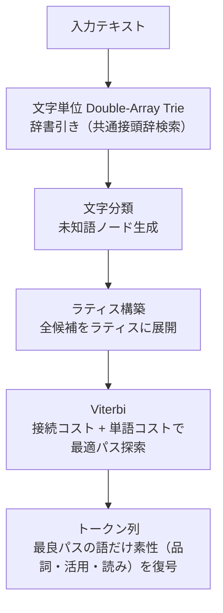

<p align="center">
  
</p>

<h1 align="center">hasami</h1>

<p align="center">
  MeCab 形式の辞書（IPAdic・NEologd・SudachiDict）に対応して読み・発音まで返し、辞書なしで動く文分割も備えた Rust 製の高速な日本語形態素解析エンジン
</p>

<!-- standard:badges:start -->
<h3 align="center">対応プラットフォーム</h3>

<p align="center">
  
  
  
</p>

<p align="center">
  <a href="https://github.com/owayo/hasami/actions/workflows/ci.yml"></a>
  <a href="https://github.com/owayo/hasami/releases/latest"></a>
  <a href="LICENSE"></a>
</p>
<!-- standard:badges:end -->

---

hasami は、MeCab などの外部の解析エンジンを使わずに Rust で一から書いた日本語の形態素解析器です。MeCab 形式の CSV から独自の形式の辞書（`.hsd`）を作り、mmap でそのまま読み込んで解析します。

配布辞書は IPAdic と、それに NEologd・SudachiDict を足した 3 つです。読み上げや品詞を手がかりにする処理（音声合成の読み、文章の検査など）で誤りの元になるエントリを直してから、リリースに添付しています。コマンドのほか、Rust・Python・C のライブラリとしても使えます。

## 機能

- **外部エンジンに依存しない**: MeCab や Sudachi を呼ばず、辞書の構築から解析までを hasami だけで行います
- **ラティスと Viterbi**: 辞書の語と未知語の候補をラティスに並べ、接続コストと単語コストの和が最小になる分け方を選びます
- **速い**: 1 スレッドでも MeCab より速く、`hasami tokenize` は標準入力の行を CPU の数だけ並列に解析します（[ベンチマーク](#ベンチマーク)）
- **読みと発音**: トークンごとに読みと発音を返します。文脈で読みが変わる語（「他」「数」など）と、1〜2 文字の英字の略語（AI・PC など）は、解析の後で読みを直します
- **MeCab 形式の辞書から作る**: MeCab 形式の CSV と matrix.def・char.def・unk.def から辞書を作ります。配布辞書は IPAdic、IPAdic + NEologd、IPAdic + NEologd + SudachiDict の 3 つで、SudachiDict は IPAdic の品詞体系に写して足します。UniDic は手元でビルドできます
- **辞書のマージと修復**: 既存の辞書に MeCab 形式の CSV を足せます。`hasami repair` は、誤読や誤った品詞の元になるエントリを直すか取り除きます
- **すぐに読み込める辞書**: 辞書は mmap でそのまま参照する形式（.hsd v4）です。読み込むときはヘッダと小さな表だけを検査し、本体は解析で触れたページだけを読みます
- **未知語の推定**: 文字の種類から未知語を推定します（char.def と unk.def を MeCab と同じ意味で読みます）。カタカナの複合語は辞書の語に分けます（「オススメ / アプリ」）
- **辞書の要らない文分割**: `hasami::sentence` は辞書を読み込まずに文の境界を求めます（feature なしで使え、依存もありません）。`Yahoo!ニュース`・`モーニング娘。` のように文末記号を含む語の内側では切りません
- **Rust・Python・C から使える**: Rust のライブラリ、Python バインディング（PyO3）、C FFI があります

## インストール

<!-- standard:install:start -->
### Cargo

Rust 1.98 以上が必要です。

```bash
cargo install --git https://github.com/owayo/hasami hasami --locked
```

### GitHub Releases から

[Releases](https://github.com/owayo/hasami/releases/latest) から自分の環境のアーカイブを取得して展開し、`hasami` を `PATH` の通った場所に置きます。各リリースには、取得したファイルを確かめるための `SHA256SUMS` も添付しています。

| プラットフォーム | ファイル |
|---|---|
| Linux (x86_64) | `hasami-x86_64-unknown-linux-gnu.tar.gz` |
| Linux (ARM64) | `hasami-aarch64-unknown-linux-gnu.tar.gz` |
| macOS (Intel) | `hasami-x86_64-apple-darwin.tar.gz` |
| macOS (Apple Silicon) | `hasami-aarch64-apple-darwin.tar.gz` |
| Windows (x86_64) | `hasami-x86_64-pc-windows-msvc.zip` |

macOS でブラウザから取得した場合は、実行の前に隔離属性を外します: `xattr -d com.apple.quarantine hasami`。

### ソースから

[mise](https://mise.jdx.dev/) が必要です (Rust のツールチェーンは `mise.toml` で固定しています)。

```bash
git clone https://github.com/owayo/hasami.git
cd hasami
make install
```

`make install` は `/usr/local/bin` に入れます。場所を変えるときは `INSTALL_PATH` を指定します (例: `make install INSTALL_PATH="$HOME/.local/bin"`)。
<!-- standard:install:end -->

### 辞書の取得

辞書はバイナリにもリポジトリにも入っていないので、入れた後に配布辞書を取ります。`hasami dict download` は、実行している hasami と同じ版のリリースから辞書を取り、置き場所（既定は `~/.local/share/hasami/`、Windows は `%LOCALAPPDATA%\hasami\`）に置きます。

```bash
hasami dict download                    # 推奨辞書（ipadic-neologd-sudachi）を置き場所に置く
hasami dict download --all              # 配布辞書 3 つをすべて取る
hasami tokenize "形態素解析のテスト"    # --dict を省くと、置いた辞書を使う
```

ソースから入れて開発するときは、辞書を `dict/` に置きます。

```bash
make dict-download   # この版のリリースから 3 辞書を dict/ に取る
make dict            # 上流のソースから作る
```

取り方のオプションと置き場所の決まり方は [docs/dictionaries.md](docs/dictionaries.md) にあります。

## 使い方

### 形態素解析 (CLI)

```bash
# 辞書を置き場所に取っておけば --dict は要らない（下の例は --dict で辞書を指定する）
hasami dict download
hasami tokenize "東京都に住んでいる"

# MeCab形式で出力
hasami tokenize --dict dict/ipadic-neologd.hsd "東京都に住んでいる"

# 分かち書き
hasami tokenize --dict dict/ipadic-neologd.hsd --format wakachi "東京都に住んでいる"

# JSON形式
hasami tokenize --dict dict/ipadic-neologd.hsd --format json "東京都に住んでいる"

# 標準入力から
echo "形態素解析のテスト" | hasami tokenize --dict dict/ipadic-neologd.hsd

# --dict を省くと、環境変数 HASAMI_DICT → 置き場所（既定は ~/.local/share/hasami/）の *.hsd の順に辞書を探す
HASAMI_DICT=dict/ipadic-neologd-sudachi.hsd hasami tokenize "形態素解析のテスト"
hasami tokenize -d "$(hasami dict path ipadic)" "形態素解析のテスト"   # 置き場所の ipadic を使う

# 大量の行は並列に解析する（-j の既定は CPU の数。出力の順序は入力どおり。-j 1 で 1 スレッド）
hasami tokenize --dict dict/ipadic-neologd.hsd -j 4 < corpus.txt > corpus.mecab
```

MeCab 形式の出力は次のようになります（`ipadic-neologd.hsd`）。

```text
東京都	名詞,固有名詞,地域,一般,東京都,トウキョウト,トーキョート
に	助詞,格助詞,一般,*,に,ニ,ニ
住ん	動詞,自立,*,*,住む,スン,スン
で	助詞,接続助詞,*,*,で,デ,デ
いる	動詞,非自立,*,*,いる,イル,イル
EOS
```

標準入力は行ごとに解析します（前後の空白を除き、空行は飛ばします）。出力はまとめて書き出しますが、次の入力を待つ前にはそれまでの結果を書き出すので、1 行ずつ送って結果を読む使い方もできます。

### Rust

crates.io には公開していないので、git の依存として使います（`hasami` の名前は crates.io では別のプロジェクトが使っています）。

```toml
[dependencies]
# 解析まで（Analyzer・Dictionary・Token と sentence）。依存は memmap2 と bytemuck だけになる
hasami = { git = "https://github.com/owayo/hasami", default-features = false, features = ["analyzer"] }
```

```rust
use hasami::Analyzer;

let mut analyzer = Analyzer::load("dict/ipadic-neologd.hsd")?;
let tokens = analyzer.tokenize("東京都に住んでいる");

for token in &tokens {
    println!("{}\t{}\t{}", token.surface, token.pos, token.reading);
}
```

feature の選び方と版の固定、辞書の取得と埋め込み、文分割、品詞の正規化、並行解析は [docs/rust-api.md](docs/rust-api.md) にあります。

### Python と C

Python バインディング（`hasami-python/`）は PyPI に公開していないので、このリポジトリから maturin で入れます。

```python
import hasami

# 辞書をロード
analyzer = hasami.Analyzer("dict/ipadic-neologd.hsd")

# 形態素解析
tokens = analyzer.tokenize("東京都に住んでいる")
for token in tokens:
    print(f"{token.surface}\t{token.pos}")
```

入れ方と API は [docs/python-api.md](docs/python-api.md) に、C から使うときの関数は [docs/c-api.md](docs/c-api.md) にあります。

## 辞書

配布辞書は 3 つあり、リリースに添付しています（リポジトリには置いていません）。

| 辞書 | 内容 | 大きさ | 推奨用途 |
|------|------|------:|---------|
| `ipadic` | IPAdic 単体 | 18 MB | 軽量・基本用途 |
| `ipadic-neologd` | IPAdic + NEologd | 222 MB | 新語・固有名詞対応 |
| `ipadic-neologd-sudachi` | IPAdic + NEologd + SudachiDict | 238 MB | **推奨**（最大語彙） |

- [docs/dictionaries.md](docs/dictionaries.md): 取り方のオプション、置き場所、上流のソースからのビルド、手動での構築、辞書形式（.hsd）、配布辞書のライセンス
- [docs/dictionary-repair.md](docs/dictionary-repair.md): `hasami repair` の修復（文や句の名詞・数と単位の組の削除、一般語の固有名詞の降格、外国人名の除去）

## アーキテクチャ



空白と未知語の扱いは、MeCab と比べながら [docs/architecture.md](docs/architecture.md) で説明しています。辞書形式を作り直したときと解析を速くしたときの記録は、[docs/hsd-format.md](docs/hsd-format.md) と [docs/performance.md](docs/performance.md) にあります。

## ベンチマーク

livedoor ニュースコーパスの本文 132,876 行（24.3MB）を標準入力から読み、MeCab 形式で出力するまでの時間です（Apple M2）。

| | ipadic | ipadic-neologd-sudachi |
|---|---:|---:|
| MeCab 0.996（`mecab -b 1000000`） | 3.09s | — |
| hasami（`-j 1`） | 1.24s | 1.62s |
| hasami（既定。CPU の数だけ並列） | 0.43s | 0.49s |

表の値は、未知語の品詞を unk.def のテンプレートすべてから選ぶようにする前に測ったもので、この変更で解析の時間は約 15% 増えています（ipadic・推奨辞書とも）。辞書のロードは 3 辞書とも 1ms 未満です。ライブラリだけの解析速度と計測の方法は [docs/benchmark.md](docs/benchmark.md) にあります。

## 開発

<!-- standard:dev:start -->
[mise](https://mise.jdx.dev/) が必要です。ツールの版は `mise.toml` で固定しています。

```bash
make setup   # ツールチェーン (mise) と依存を取得する
make ci      # CI と同じ検査 (書き換えない)
```

| コマンド | 説明 |
|---|---|
| `make setup` | ツールチェーン (mise) と依存を取得する |
| `make build` | デバッグ版をビルドする |
| `make release` | リリース版をビルドする |
| `make run` | デバッグ版を実行する (引数は ARGS="...") |
| `make test` | テストを実行する |
| `make lint` | clippy を警告ゼロで通す |
| `make fmt` | コードを整形する (書き換える) |
| `make fmt-check` | 整形済みかを確かめる (書き換えない) |
| `make check` | 整形と静的検査 (書き換えない) |
| `make ci` | CI と同じ検査 (書き換えない) |
| `make install` | リリース版を INSTALL_PATH (既定 /usr/local/bin) に入れる |
| `make uninstall` | INSTALL_PATH から取り除く |
| `make clean` | ビルド成果物を消す |

`make` でターゲットの一覧を表示します。リリースは GitHub Actions で行います (**Actions → Release → Run workflow**)。
<!-- standard:dev:end -->

clone したら、大きなファイルのコミットを止めるフックを一度入れてください。

```bash
make setup-hooks   # 50MB を超えるファイルをコミットしようとすると pre-commit が止める
```

`make dict` 系と UniDic の取得には git・curl・xz・unzip が要ります（mise では入れません）。ライブラリとして使う 3 つの構成の検査、Python バインディングのビルド、配布辞書を使うテスト、CI とリリースの流れは [docs/development.md](docs/development.md) にあります。

## ライセンス

<!-- standard:license:start -->
[MIT](LICENSE) AND [NAIST-2003](THIRD_PARTY_LICENSES.md) AND [Apache-2.0](LICENSE-APACHE-2.0) AND [BSD-3-Clause](THIRD_PARTY_LICENSES.md)
<!-- standard:license:end -->

コードは MIT です。ライブラリに埋め込む文分割の例外表（`src/sentence/builtin_exceptions.txt`）は、配布辞書の表層形から抽出したものです。元のデータは mecab-ipadic（NAIST-2003）・mecab-ipadic-NEologd（Apache-2.0）・SudachiDict（Apache-2.0。UniDic（BSD-3-Clause）を含む）です。hasami をリンクしたバイナリには、辞書を同梱しなくてもこの表が入るので、配布するときは [`src/sentence/builtin_exceptions.NOTICE`](src/sentence/builtin_exceptions.NOTICE) の表示を添えてください（詳細は [THIRD_PARTY_LICENSES.md](THIRD_PARTY_LICENSES.md)）。

配布辞書は IPAdic（NAIST-2003）・mecab-ipadic-NEologd（Apache-2.0）・SudachiDict（Apache-2.0）から作っています。辞書を再配布するときは、リリースに添付している `THIRD_PARTY_LICENSES.md` を一緒に配ってください。各辞書の著作権表示は [docs/dictionaries.md](docs/dictionaries.md) の「配布辞書のライセンス」にあります。
