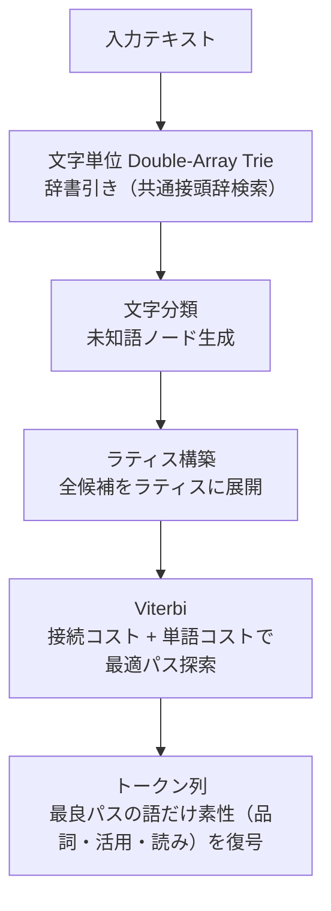

<p align="center">
  
</p>

<h1 align="center">hasami</h1>

<p align="center">
  <strong>高速日本語形態素解析エンジン（Rust製）</strong>
</p>

<p align="center">
  <a href="https://github.com/owayo/hasami/actions/workflows/ci.yml">
    
  </a>
  <a href="https://github.com/owayo/hasami/releases/latest">
    
  </a>
  <a href="LICENSE">
    
  </a>
</p>

---

## 概要

外部の形態素解析エンジンに一切依存せず、ゼロベースで構築された高性能・高精度な日本語形態素解析ツールです。

## 特徴

- **高速**: MeCab比 **2.8倍** の解析速度（374,000+ sentences/sec）
- **高精度**: ラティス構築 + Viterbiコスト最小化による最適分割
- **ゼロ依存**: MeCab/Sudachi等の外部エンジンに非依存
- **多言語対応**: Rust / Python / C FFI から利用可能
- **MeCab辞書互換**: IPAdic / UniDic 等のMeCab形式辞書をそのまま利用可能
- **辞書マージ**: 既存辞書にMeCab形式CSVを追加可能
- **高速辞書ロード**: mmap-native バイナリ形式（.hsd v4）。ロード時はヘッダと小さな表だけを検査し、本体は解析で触れたページだけを読む
- **未知語処理**: 文字分類ベースの未知語推定（unk.def対応）

## 動作環境

- **OS**: macOS、Linux
- **Rust**: 1.85以上（ソースからビルドする場合）

## インストール

### ソースからビルド

辞書は Git LFS で管理している。clone したら最初に一度フックを入れておく
（`git lfs install` 済みの環境かどうかに関わらず、LFS を通らない大きなファイルを
コミットしようとしたときに pre-commit が止める）。

```bash
make setup-hooks
```

```bash
make install

# ワークスペース全体をビルド
cargo build --workspace
```

### バイナリダウンロード

[Releases](https://github.com/owayo/hasami/releases) から最新版をダウンロード。

## アーキテクチャ



## 辞書

### ビルド済み辞書

`dict/` ディレクトリにビルド済み辞書（.hsd）が含まれています（Git LFS管理）。

| ファイル | 内容 | 推奨用途 |
|---------|------|---------|
| `dict/ipadic.hsd` | IPAdic 単体 | 軽量・基本用途 |
| `dict/ipadic-neologd.hsd` | IPAdic + NEologd | 新語・固有名詞対応 |
| `dict/ipadic-neologd-sudachi.hsd` | IPAdic + NEologd + SudachiDict | **推奨**（最大語彙） |

以下の辞書はリポジトリには同梱されていませんが、ローカルでビルドできます。

| ファイル | 内容 | ビルドコマンド |
|---------|------|--------------|
| `dict/unidic-cwj.hsd` | UniDic CWJ（書き言葉） | `make dict-unidic-cwj` |
| `dict/unidic-csj.hsd` | UniDic CSJ（話し言葉） | `make dict-unidic-csj` |

### 辞書のローカルビルド

配布辞書 3 つは `scripts/build-dict.sh` が上流のソースから作る。`git`, `curl`, `xz`, `unzip`, `python3` が必要。

```bash
# 配布辞書 3 つをすべて作る（dict/ に書き出す）
make dict                 # = scripts/build-dict.sh

# 個別に作る
make dict-ipadic          # IPAdic のみ
make dict-neologd         # IPAdic + NEologd
make dict-sudachi         # IPAdic + NEologd + SudachiDict（推奨）

# 配布しない辞書
make dict-unidic-cwj      # UniDic CWJ（書き言葉）
make dict-unidic-csj      # UniDic CSJ（話し言葉）

# ダウンロードしたソースと中間成果物を削除
make dict-clean
```

| 辞書 | 作り方 |
| --- | --- |
| `ipadic.hsd` | IPAdic を `scripts/prepare_ipadic.py` で整えて build し、外国人名の姓・名だけを除く（発音の修復は掛けない） |
| `ipadic-neologd.hsd` | IPAdic に NEologd の seed を merge し、repair 一式（範囲外 ID・表記ゆれ・漢数字の人名・`dict/user-remove/*.csv`・一般語の固有名詞の降格）を掛けてから `dict/user/*.csv` を足す |
| `ipadic-neologd-sudachi.hsd` | IPAdic + NEologd に SudachiDict の raw 辞書を `scripts/convert_sudachi_raw.py` で変換して merge し、同じ repair 一式を掛ける |

`scripts/prepare_ipadic.py` は上流の IPAdic を書き換えずに、次の 2 点を変えたソースを作る（何を変えたかは
辞書のメタデータ `ipadic_patch` に残る）。

- **記号の未知語**: IPAdic の char.def は `— 。 、 「 ♪ ⇒` などを SYMBOL（まとめて 1 語）にし、unk.def はその未知語を
  「名詞,サ変接続」にする。このままだと辞書に無い記号の並びが句点ごと 1 つの名詞になる（「楽しみたい——。」の「——。」）。
  SYMBOL を「既知語がある位置では未知語を作らず、作るときも 1 文字ずつ」「記号,一般」に変える
- **EUC-JP の変換差**: IPAdic の CSV は EUC-JP で、ダッシュ・波ダッシュ・マイナスなど 7 字は変換表によって
  写し先が分かれる。hasami は JIS の対応表どおり（MeCab と同じ）「—」「〜」「−」に写し、Windows 由来の文章が使う
  「―」「～」「－」の別表記を表層形に足す（33 語。「あ〜」と「あ～」のどちらでも感動詞「アー」になる）

SudachiDict は内容語（名詞・固有名詞・形状詞・連体詞・副詞・接続詞・感動詞・動詞・形容詞）と記号だけを取り込み、
IPAdic・NEologd・`dict/user` に表層形がある語は落とす。品詞は IPAdic 体系に写し、文脈 ID は IPAdic の left-id.def から
引く（対応する ID が無い品詞・活用形は取り込まない）。原形は SudachiDict の辞書形なので、活用語の原形が正しくなる
（「誤っ」→「誤る」、「示し」→「示す」、「読み込み」→「読み込む」）。取り込み範囲はニュース 2 万行で比べて決めた。

| 取り込む範囲 | 追加語数 | 読みが変わる行 | 解析時間（IPAdic + NEologd 比） |
| --- | --- | --- | --- |
| 旧方式（変換済み CSV を範囲外 ID ごと取り込み） | +179 万 | 49.3% | 1.75〜1.9 倍 |
| 全品詞・既存語との重複を残す | +141 万 | 37.8% | 1.22〜1.29 倍 |
| 名詞・表層形が既存語と同じなら落とす | +24 万 | 5.6% | 1.0 倍 |
| **内容語 + 記号・表層形が同じなら落とす（採用）** | +40 万 | 7.0% | 1.0〜1.03 倍 |

採用した範囲で読みが変わった箇所を無作為に 60 件見ると、改善 48・悪化 5・同等 7 だった（改善は英単語の読み
「cafe→カフェ」、複合語「加齢→カレイ」、半角記号が名詞でなく記号になる、など）。

上流はすべて版を固定している（IPAdic・NEologd は git の commit、SudachiDict はダウンロードの SHA-256）。
取得物は `.dict-src/` に置き、2 回目以降は再取得しない。中間成果物（repair を掛ける前の辞書、SudachiDict の
変換結果など）は実行ごとの作業ディレクトリに作って終了時に消すので、`dict/` の配布辞書のほかには残らない。
repair を手で試し直すために repair 前の辞書が要るときは、`scripts/build-dict.sh --keep-intermediate` で
`.dict-src/build/*.base.hsd` に残す。
3 辞書の作り直しは取得済みなら 5 分ほどで終わる（うち SudachiDict の変換が 3 分、最大 RSS は約 3GB）。

`dict/user/*.csv` には `#` で始まるコメント行を書ける。`#` で始まってもエントリの列数（13 列）が
そろった行は語として読む（NEologd には `#` で始まるハッシュタグの語がある）。

### 辞書の手動構築

MeCab形式の辞書から直接ビルドすることもできます。

```bash
# MeCab形式CSV ディレクトリから辞書をビルド
hasami build --input ./ipadic/ --output dict.hsd

# 既存辞書にCSVを追加マージ
hasami merge --dict dict.hsd --input custom_words.csv
hasami merge --dict dict.hsd --input ./extra_dict/ --output merged.hsd

# メタデータ（辞書名・品詞体系・上流の版）を付ける
hasami build --input ./unidic/ --output unidic.hsd --meta pos_scheme=unidic --meta sources=unidic-cwj@202512

# 辞書の情報と全件検証、MeCab 形式 CSV（活用型・活用形付き）への書き出し
hasami info --dict dict.hsd --verify
hasami export --dict dict.hsd --output lex.csv
```

### 辞書形式 (.hsd)

`.hsd` は v4 形式（64 バイトのヘッダ + セクション表 + 64 バイト境界のセクション）。mmap してそのまま参照するので、
ロードはヘッダと小さな表の検査だけで 1ms 前後、解析で触れたページだけが読み込まれる。

- 表層形は文字単位の double-array trie（単独の末尾は圧縮）に持ち、エントリは 1 件 6 バイト
- 品詞・活用型・活用形・読み・発音・原形は重複を除いた素性レコードに持ち、最良パスの語だけ復号する
- 辞書の中身はメタデータ（`hasami info` で表示）に名前・品詞体系・上流の版・掛けた repair が残る
- 壊れたファイルはロード時・解析時に `DictError` になる（panic しない）。全件の検査は `hasami info --verify`
- v3 以前の `.hsd` は読めない。`scripts/build-dict.sh`（または `hasami build`）で作り直す
- 書き出しは一時ファイルに書いてから rename で差し替える。読み込み中の辞書ファイルを直接書き換えてはいけない

`--prune-dominated`（build / merge / repair）は、同じ表層形・同じ文脈 ID の中でコストが最小でないエントリを除いた
最終辞書を作る。解析結果（1-best）は変わらないが、除いた辞書は merge・repair の入力にできない。配布辞書には掛けていない。

形式の設計・試したこと・計測は [docs/hsd-format.md](docs/hsd-format.md) にまとめてある。

### 辞書の修復

複数の辞書ソースをマージすると、ソース側の欠陥がそのまま残ることがある。
`hasami repair` は読み上げや品詞を使う処理で問題になる次のエントリを修復・除去する。

```bash
hasami repair --dict dict/ipadic-neologd-sudachi.hsd \
    --output dict/repaired.hsd \
    --drop-invalid-context-ids \
    --drop-ortho-variants \
    --drop-numeral-misreadings \
    --remove dict/user-remove/misreading-entries.csv \
    --remove dict/user-remove/foreign-names.csv \
    --demote-common-proper-nouns dict/ipadic.hsd \
    --merge dict/user/english-reading-fixes.csv
```

| 対象 | 内容 |
| --- | --- |
| `--drop-invalid-context-ids` | 接続行列の範囲外の文脈 ID を持つエントリを削除する。範囲外の ID は接続コスト 0 として扱われ、他の候補に不当に勝つ。推奨辞書には、SudachiDict の文脈 ID のまま混入した重複が 137 万件ある |
| 壊れた発音（常時） | 発音フィールドに表層形が入っているエントリ（SudachiDict 由来）を、同じ (表層形, 読み) を持つ健全なエントリの発音形で置き換える。借用できなければ読みを使い、読みもラテン文字のままなら空にして解析時の読み補完に委ねる。記号（「、」「。」「「」等）は読み・発音に記号そのものを持つ（MeCab・OpenJTalk と同じ）ので変えない。`--no-pronunciation-repair` で省ける（削除リストだけを適用したいとき） |
| `--drop-ortho-variants` | 活用語・機能語と衝突する名詞エントリを削除する。「高い」→「高位(コウイ)」、「学ぶ」→「学部(ガクブ)」等が形容詞・動詞に勝って誤読になるのを防ぐ。代名詞と衝突する 1 文字の人名（「何」→姓の「ガ」）も落とす |
| `--drop-numeral-misreadings` | 漢数字だけで綴られた固有名詞を削除する。「十五(トウゴ)」「二十八(ツチヤ)」等が数詞に勝つのを防ぐ。「万一」「八百万」のような一般語・副詞は残す |
| `--remove <CSV>` | CSV に列挙したエントリを削除する。列は `表層形,読み[,品詞]`。3 列目の品詞 (例 `"名詞,固有名詞,人名"`) を書くと、その品詞で始まるエントリだけを消す。品詞は `,` で区切った要素ごとに前から比べる。3 列目を省くと品詞を問わず消す。どのエントリにも当たらなかった行は件数と例を表示する |
| `--demote-common-proper-nouns <IPAdic の .hsd>` | NEologd が「名詞,固有名詞,一般」で登録した一般語（成果物・多角的・可視化・安全性・担当者 等）を一般名詞に降格する。判定は下の「一般語の固有名詞の降格」。参照する IPAdic 単体の辞書は、修復する辞書と同じ接続行列を持つこと（配布辞書どうしなら同じ） |
| `--merge <PATH>` | 修復後に MeCab 形式 CSV を追加マージする。trie の再構築が 1 回で済むので、`repair` と `merge` を続けて実行するより速い |

処理は「範囲外 ID の削除 → 壊れた発音の修復 → `--drop-*` → `--remove` → `--demote-common-proper-nouns` → `--merge`」の順に行う。
範囲外 ID のエントリを発音の借用元に使わないよう、最初に落とす。削除リストは上流の辞書の品詞で書くので降格より先に、
`--merge` で足す語は降格の対象にしないので最後に適用する。

`dict/user-remove/` に削除リスト、`dict/user/` に追加エントリを置いてある。
`make dict-neologd` / `make dict-sudachi` は最後にこの修復を実行する。配布辞書をその場で直すなら
`make dict-repair DICT=...`（`dict/user` は配布辞書に追加済みなので足し直さない。降格の参照には `dict/ipadic.hsd` を使う）。

`hasami build` / `merge` / `repair` は、trie を作る前に全エントリの文脈 ID が接続行列の範囲内かを検査する。
範囲外があればエラーで止まるので、既存の辞書は `--drop-invalid-context-ids` を付けて修復する。
`build` は matrix.def を CSV より先に読むので、CSV の行番号付きでエラーになる。

#### 一般語の固有名詞の降格

NEologd は Web 上の見出し語を取り込んでいるので、「成果物」「多角的」「可視化」「安全性」「担当者」のような
一般語が「名詞,固有名詞,一般」になっている。固有名詞を具体性の手掛かりに数える処理（文章の Linter の
[noslop](https://github.com/owayo/noslop) など）では、抽象的な文が具体的に見えてしまう。品詞に合わせて
接続コストも固有名詞のものになるので、「言語化と可視化」の「言語化」が「言語 / 化」に割れたりもする。

`--demote-common-proper-nouns` は「名詞,固有名詞,一般」のエントリの表層形を IPAdic 単体の辞書で解析し、
次をすべて満たすものを降格する。

1. すべて既知語で、一般名詞・サ変接続・形容動詞語幹の連続 + 接尾辞に分かれる。途中の接尾辞は「的」だけを
   認め、前後に名詞を置く（「心理 / 的 / 安全 / 性」）。英字などの未知語を含む語（「AACTA賞」）は対象外
2. 語末の接尾辞が一般名詞を作るもの: 的・化・性・者・物・学・力・率・感・度・費・料・権・症・制・体・器・業・
   剤・員・官・数・罪・病・術
3. エントリの読みが、IPAdic にあるその接尾辞の読み（固有名詞の読みを除く。「力」ならリョク・リキ・チカラ）で終わる

降格先は `名詞,一般`（「〜化」は `名詞,サ変接続`、「〜的」は `名詞,形容動詞語幹`）で、文脈 ID は IPAdic が
その品詞に最も多く使う組（1285 / 1283 / 1287）に付け替える。コスト・原形・読み・発音は変えない。
配布辞書では `ipadic-neologd.hsd` で 146.7 万件中 5,841 件、`ipadic-neologd-sudachi.hsd` で 148.2 万件中
5,853 件を降格する（`scripts/build-dict.sh` は同じ実行で作る IPAdic の中間辞書（repair 前）を参照に使う）。
降格した語のうち NEologd の読みが誤っているもの（「必然的(ヒツザンテキ)」「君主制(キョウワセイ)」など 21 語）は、
降格で文中に出やすくなるので `dict/user-remove/misreading-entries.csv` で落としている。

接尾辞を表層形で限るのは、IPAdic の「名詞,接尾,一般」に固有名詞を作る語も多いため（「〜線」路線名、
「〜法」法律名、「〜院」寺院名、「〜会」団体名、「〜社」「〜賞」「〜峠」「〜岳」）。許可する接尾辞は、
SudachiDict の普通名詞・固有名詞の分類を参照して絞り、降格される語を接尾辞ごとに目で見て決めた。
「〜論」（「国富論」「資本論」など著作名が 1 割近い）、「〜型」（「吹雪型」「秋月型」など艦級名）、
「〜系」（「ナスルーラ系」など競走馬の父系名）、「〜書」「〜式」は外した。「〜力」「〜度」には人名・社名が
数 % 混ざる（「北勝力」「格力」「公孫度」）が、読みは変わらないので、「説得力」「満足度」のような抽象語を
拾える方を採った。読みの条件は、接尾辞を字どおりに読まない人名・作品名（「こだま学(コダママナブ)」
「かわら力(カワラツトム)」「鉄道員(ポッポヤ)」）を除くためのもので、「目力(メヂカラ)」のように連濁する
一般語も固有名詞のまま残る。

規則に当たらない語は個別に直す。`dict/user-remove/common-words-as-proper-nouns.csv` で固有名詞のエントリを
落とし（ステークホルダー、エンゲージメント・ユースケース（原形が「ANGAGEMENT」「Youth case」の人名もある）、
爆速）、`dict/user/common-word-fixes.csv` で一般名詞として足す。同じファイルで、割れてしまう「深掘り」
「深堀り」（原形は「深掘り」）「腹落ち」を名詞,サ変接続で足している。

#### 外国人名の除去

中国・朝鮮系の 1 文字姓は日常語と衝突して誤読を招く（「金がない」→ 朝鮮の姓の「金(キム)」で「キムガナイ」、
「何なのか」→ 中国の姓の「何(ガ)」で「ガナノカ」）。日本語の読み上げに特化するため、日本の姓名でない
人名エントリを削除リストで落とす。

| ファイル | 中身 | 適用 |
| --- | --- | --- |
| `dict/user-remove/foreign-names.csv` | 外国人の姓・名のエントリ（林=リン、金=キム、王=ワン、在訓=ジェフン、カタカナの ジョンソン・ブライアン 等）と、1 文字の外国人名 | `make dict-repair` で常に適用 |
| `dict/foreign-names/full-names.csv` | 外国人のフルネーム（毛沢東=モウタクトウ、金正日=キムジョンイル、劉備=リュウビ 等） | 任意（`--remove` に足す） |

フルネームを既定で消さないのは、文中の外国人名の読みが崩れるため。推奨辞書で試すと、「李白」が「スモモシロ」、
「諸葛亮」が「モロクズアキラ」、「金正日」が「カネマサビ」、「毛沢東」が「ケタクトウ」になる。
フルネームは日常語とほとんど衝突しないので、残しても誤読の原因になりにくい。

削除リストは `scripts/find_foreign_names.py` が生成する。人名エントリの読みを Unicode Unihan の字音と照合し、
次の候補を挙げる。

- 全漢字が朝鮮語の字音か普通話で読まれ、日本語の字音では説明できない名前（由美=ユミ のように日本語でも読めるものは挙げない）
- 1 文字姓の音読み（日本の姓として使われる 伴=バン・菅=カン などは許可リストで残す）
- 中国の複姓（司馬、諸葛）
- 日本人名の読みに無いカタカナの姓・名

判定の誤りは `dict/foreign-names/allow.csv`（日本人名として残す）と `deny.csv`（規則で拾えない外国人名）に書いて再生成する。

```bash
hasami export --dict dict/ipadic-neologd-sudachi.hsd --output /tmp/lex.csv
python3 scripts/find_foreign_names.py /tmp/lex.csv \
    --parts dict/user-remove/foreign-names.csv \
    --full dict/foreign-names/full-names.csv \
    --audit /tmp/foreign-names-audit.tsv   # 全候補と判定理由（レビュー用）
```

削除リストは 3 列目で品詞を人名に限っている。品詞を限らずに消すと、同じ表層形・読みの人名以外の語
（接頭辞「高(コウ)」、助数詞「金(キン)」、国名「周(シュウ)」、名詞「パン」など、推奨辞書で 978 件）まで消える。

Unihan は初回に `.dict-src/unihan/` へダウンロードし、SHA-256 を検証する（Unicode 18.0.0、
[Unicode License v3](https://www.unicode.org/license.txt)）。Unihan のデータ自体はリポジトリに含めない。

## 使い方

### 形態素解析 (CLI)

```bash
# MeCab形式で出力
hasami tokenize --dict dict/ipadic-neologd.hsd "東京都に住んでいる"

# 分かち書き
hasami tokenize --dict dict/ipadic-neologd.hsd --format wakachi "東京都に住んでいる"

# JSON形式
hasami tokenize --dict dict/ipadic-neologd.hsd --format json "東京都に住んでいる"

# 標準入力から
echo "形態素解析のテスト" | hasami tokenize --dict dict/ipadic-neologd.hsd

# --dict を省くと、環境変数 HASAMI_DICT → ~/.local/share/hasami/*.hsd の順に辞書を探す
HASAMI_DICT=dict/ipadic-neologd-sudachi.hsd hasami tokenize "形態素解析のテスト"
```

### Rust API

#### ライブラリとして使う

crates.io には公開していない（`hasami` の名前は別のプロジェクトが使っている）。git 依存で使う。

```toml
[dependencies]
# 解析だけ（Analyzer・Dictionary・sentence）。依存は memmap2 と bytemuck だけになる
hasami = { git = "https://github.com/owayo/hasami", default-features = false }
# 辞書も作るなら（DictBuilder、MeCab 形式 CSV の読み書き）
# hasami = { git = "https://github.com/owayo/hasami", default-features = false, features = ["build"] }
```

| feature | 中身 | 追加の依存 |
| --- | --- | --- |
| （なし） | 解析（`Analyzer`・`Dictionary`・`Token`・`sentence`）、C FFI | memmap2, bytemuck |
| `build` | 辞書の構築・修復・書き出し（`DictBuilder`、`write_lexicon_csv`） | csv, encoding_rs, glob |
| `cli` | `hasami` コマンド（`build` を含む） | clap, indicatif, serde_json |

既定は `cli`（`cargo install` やこのリポジトリでのビルドで CLI が使える）。

**版の方針**: 0.x の間は minor 版で API と辞書形式を変えることがある。辞書形式を変えたときは、古い `.hsd` を
読み込むと作り直しを案内するエラーになる（`scripts/build-dict.sh` で上流から作り直す）。

#### 基本

```rust
use hasami::Analyzer;

let mut analyzer = Analyzer::load("dict/ipadic-neologd.hsd")?;
let tokens = analyzer.tokenize("東京都に住んでいる");

for token in &tokens {
    println!("{}\t{}\t{}", token.surface, token.pos, token.reading);
}

// 活用型・活用形（活用しない語・未知語は空文字列）
let tokens = analyzer.tokenize("読み込み、");
println!("{} {}", tokens[0].conj_type, tokens[0].conj_form); // 五段・マ行 連用形

// バッチ処理
let results = analyzer.tokenize_batch(&["文1", "文2", "文3"]);
```

`tokenize` は辞書に不正な参照を見つけると panic する（`hasami info --verify` で検証済みの辞書では起きない）。
検証していない辞書を扱うときは、エラーを返す `try_tokenize` を使う。

```rust
match analyzer.try_tokenize("東京都に住んでいる") {
    Ok(tokens) => { /* ... */ }
    Err(e) => eprintln!("壊れた辞書: {e}"),
}
```

`Token` のフィールドは `surface`・`start`・`end`（入力のバイト位置）・`pos`（品詞 4 階層）・`conj_type`・`conj_form`・
`base_form`・`reading`・`pronunciation`・`word_cost`・`is_known`。

辞書は mmap で読み込むので、読み込み中の辞書ファイルを書き換えたり切り詰めたりしてはいけない。
辞書を差し替えるときは別名で書いてから rename する（`hasami build` / `merge` / `repair` の出力はそうしている）。

#### 辞書の既定の場所

`Analyzer::load_default()` は次の順に辞書を探す。見つからなければ探した場所を持つ `DictError::NotFound` を返すので、
辞書なしでも動く利用者はこのエラーのときだけ辞書なしに切り替えればよい。

1. 環境変数 `HASAMI_DICT`（辞書ファイルのパス）
2. `$XDG_DATA_HOME/hasami/`（未設定なら `~/.local/share/hasami/`）の `*.hsd`。複数あれば
   `ipadic-neologd-sudachi.hsd` → `ipadic-neologd.hsd` → `ipadic.hsd` → そのほかの名前順

```rust
let mut analyzer = match hasami::Analyzer::load_default() {
    Ok(a) => Some(a),
    Err(hasami::DictError::NotFound(_)) => None, // 辞書なしで動く
    Err(e) => return Err(e.into()),
};
```

#### 文分割（辞書不要）

`hasami::sentence` は辞書をロードせずに日本語の文境界を求める。括弧の対応を取ってから括弧の内側の文末記号を
無視し、`Yahoo!ニュース`・`モーニング娘。`・`Hey!Say!JUMP` のように文末記号を含む語（推奨辞書から抽出した
2 万語の例外表）の内側では切らない。URL の `?` や `!important` でも切らない。

```rust
use hasami::sentence::{self, LineBreaks, SplitOptions};

let text = "「うまく行くかな？」と思った。Yahoo!ニュースを見た。";
let sentences: Vec<&str> = sentence::split(text, &SplitOptions::default())
    .into_iter()
    .map(|s| &text[s.range])
    .collect();
assert_eq!(sentences, ["「うまく行くかな？」と思った。", "Yahoo!ニュースを見た。"]);

// 改行で区切る・例外語を足す。繰り返し使うなら Splitter を作って使い回す
let options = SplitOptions {
    line_breaks: LineBreaks::Split,
    extra_exceptions: &["ヤッター!マン"],
    ..SplitOptions::default()
};
let splitter = sentence::Splitter::new(&options);
```

形態素解析の前分割（ラティスを小さく保つための区切り）にも同じ規則を使っているので、例外表の語は解析でも割れない。
文ごとにトークン列が欲しいときは `Analyzer::tokenize_sentences` を使う（トークンの位置は入力全体のバイト位置）。

```rust
for (sentence, tokens) in analyzer.tokenize_sentences(text, &SplitOptions::default()) {
    println!("{}: {} tokens", &text[sentence.range.clone()], tokens.len());
}
```

#### 品詞の正規化・否定・モーラ数

`Token::coarse_pos` は、辞書の品詞体系（IPAdic 系・UniDic 系）の違いを吸収した粗い品詞 `CoarsePos` を返す。
辞書を替えても同じ判定ができるように、次の違いをそろえている。

- 「の」は IPAdic の `助詞,連体化` と `助詞,格助詞`、UniDic の `助詞,格助詞` のどれでも `CaseParticle`。
  「行くのが」の「の」は `FormalNoun`
- 形式名詞（こと・もの・わけ）は `FormalNoun`。UniDic は普通名詞と区別しないので、仮名書きの形式名詞を表層形で拾う
- 受け身・使役の「れる」「せる」（IPAdic では `動詞,接尾`）と、助動詞の語幹「そう」「よう」「みたい」は `AuxVerb`
- 記号は句点（。！？!? など）・読点（、，,）・開き括弧・閉じ括弧・そのほかを区別する。辞書によって品詞が違う
  半角の `(` `!` `,` や全角の `！` も、表層形で見分けて同じ値にする

`Token::is_negation` は否定の形態素か（助動詞「ない」「ぬ」「ん」「ず」、形容詞「ない」）を原形で判定する。
`Token::mora_count` は発音（仮名が無ければ読み）からモーラ数を数える。拗音の小書き文字は直前の仮名と合わせて
1 モーラ、促音・撥音・長音は 1 モーラ。

```rust
use hasami::CoarsePos;

let tokens = analyzer.tokenize("運用コストの削減の実現");
let chained = tokens
    .iter()
    .filter(|t| &*t.surface == "の" && t.coarse_pos() == CoarsePos::CaseParticle)
    .count();
assert_eq!(chained, 2);

let tokens = analyzer.tokenize("行かないわけではない");
assert_eq!(tokens.iter().filter(|t| t.is_negation()).count(), 2);

let morae: usize = analyzer.tokenize("東京に行った").iter().map(|t| t.mora_count()).sum();
assert_eq!(morae, 8); // トーキョー ニ イッ タ
```

辞書の品詞に従うので、そろわない違いもある（「しか」は IPAdic では係助詞、UniDic では副助詞など）。

#### 並行解析（Rust マルチスレッド）

`Analyzer` は `Clone` を実装しており、辞書（mmap）を `Arc` で共有しつつ各クローンが独自のラティスワークスペースを持ちます。複数スレッドで並列解析する際、辞書はゼロコピー共有・ワークスペースのみ独立になります。

```rust
use hasami::Analyzer;

let analyzer = Analyzer::load("dict/ipadic-neologd.hsd")?;
analyzer.prewarm(); // 解析で触れる辞書のページを先に読み込み、初回の待ちを避ける

let inputs: Vec<&str> = vec!["文1", "文2", "文3", "文4"];
let results: Vec<Vec<_>> = std::thread::scope(|s| {
    inputs
        .iter()
        .map(|input| {
            let mut worker = analyzer.clone(); // 辞書共有・ワークスペース新規
            s.spawn(move || worker.tokenize(input))
        })
        .collect::<Vec<_>>()
        .into_iter()
        .map(|h| h.join().unwrap())
        .collect()
});
```

### Python API

#### インストール

```bash
cd hasami-python
pip install maturin
maturin develop --release
```

#### 基本的な使い方

```python
import hasami

# 辞書をロード
analyzer = hasami.Analyzer("dict/ipadic-neologd.hsd")

# 形態素解析
tokens = analyzer.tokenize("東京都に住んでいる")
for token in tokens:
    print(f"{token.surface}\t{token.pos}")
```

#### 辞書マージ (Python)

```python
builder = hasami.DictBuilder()
builder.load_hsd("dict/ipadic.hsd")    # 既存辞書をロード
builder.add_csv_dir("./extra/")        # CSVを追加
builder.build("merged.hsd")           # 新しい辞書を保存
```

#### 分かち書き

```python
print(analyzer.wakachi("東京都に住んでいる"))
# => 東京都 に 住ん で いる
```

#### 並行解析（Python マルチスレッド）

`tokenize` 系メソッドは内部で GIL を解放するため、複数スレッドで真の並列処理が可能です。`clone_for_worker()` で辞書を共有しつつ、スレッドごとにワークスペースを独立化します。

```python
import hasami
from concurrent.futures import ThreadPoolExecutor

analyzer = hasami.Analyzer("dict/ipadic-neologd.hsd")
analyzer.prewarm()  # 解析で触れる辞書のページを先に読み込む（初回の待ちを避ける）

def tokenize_one(args):
    worker, text = args
    return [t.surface for t in worker.tokenize(text)]

# ワーカーごとにクローン（辞書はゼロコピー共有）
texts = ["文1", "文2", "文3", "文4"]
workers = [analyzer.clone_for_worker() for _ in texts]

with ThreadPoolExecutor(max_workers=4) as ex:
    results = list(ex.map(tokenize_one, zip(workers, texts)))
```

#### Token オブジェクトの属性

```python
token = analyzer.tokenize("猫")[0]
token.surface        # 表層形: "猫"
token.pos            # 品詞: "名詞,一般,*,*"
token.conj_type      # 活用型: ""（活用しない語・未知語は空文字列。動詞なら "五段・カ行イ音便" など）
token.conj_form      # 活用形: ""（動詞なら "連用形" など）
token.base_form      # 原形: "猫"
token.reading        # 読み: "ネコ"
token.pronunciation  # 発音: "ネコ"
token.start          # 開始バイト位置: 0
token.end            # 終了バイト位置: 3
token.word_cost      # 単語コスト: 3987
token.is_known       # 辞書語かどうか: True
token.coarse_pos     # 辞書の品詞体系をそろえた粗い品詞: "Noun"（Rust の CoarsePos の名前）
token.is_negation    # 否定の形態素か: False
token.mora_count     # モーラ数: 2
```

辞書が壊れていて解析中に不正な参照を見つけたときは `ValueError`、辞書ファイルを開けないときは `IOError` を送出する。

### C FFI

```c
#include "hasami.h"

HasamiAnalyzer* analyzer = hasami_new("dict/ipadic-neologd.hsd");
if (!analyzer) {
    fprintf(stderr, "load error: %s\n", hasami_last_error(NULL));
    return 1;
}

HasamiTokenList tokens = hasami_tokenize(analyzer, "東京都に住んでいる");
const char* error = hasami_last_error(analyzer);
if (error) {
    fprintf(stderr, "tokenize error: %s\n", error);
    hasami_free(analyzer);
    return 1;
}

for (uint32_t i = 0; i < tokens.len; i++) {
    printf("%s\t%s\n", tokens.tokens[i].surface, tokens.tokens[i].pos);
}

hasami_free_tokens(tokens);
hasami_free(analyzer);
```

`HasamiToken` のフィールドは `surface`・`start`・`end`・`pos`・`conj_type`・`conj_form`・`base_form`・`reading`・
`pronunciation`・`is_known`（文字列はすべて UTF-8 のヌル終端）。解析中に辞書の不正な参照を見つけたときは、
空のリストを返して `hasami_last_error` にエラーを入れる。

## ベンチマーク

```bash
hasami bench --dict dict/ipadic-neologd.hsd --text "東京都に住んでいる人々が増えている。" --iterations 100000
```

### 解析速度

| エンジン | sentences/sec | MeCab比 |
|----------|--------------|---------|
| MeCab (fugashi) | ~135,000 | 1.00x |
| Sudachi | ~80,600 | 0.60x |
| **hasami** | **~374,000** | **2.77x** |

### 辞書ロード速度

| エンジン | 平均 | 最速 |
|----------|------|------|
| MeCab (fugashi) | 3.1 ms | 1.9 ms |
| **hasami** (mmap) | 18.1 ms | 11.4 ms |
| Sudachi | 25.8 ms | 11.5 ms |

*Apple Silicon (M4)、IPAdic辞書使用、10文×3000イテレーションでの計測*

## 開発

```bash
# ワークスペース全体のビルド
cargo build --workspace

# ビルド
make build

# テスト実行（hasami-python は extension-module のためリンク不可、clippy で検証）
cargo test --workspace --exclude hasami-python

# clippy と フォーマットチェック
make check

# リリースビルド
make release

# 辞書ビルド（全辞書）
make dict
```

## ライセンス

[MIT](LICENSE)

### 同梱辞書のライセンス

本リポジトリの `dict/` ディレクトリに同梱されている辞書は、以下のソースから構築されています。各辞書の著作権・ライセンスにしたがってご利用ください。

#### IPAdic (`dict/ipadic.hsd`, `dict/ipadic-neologd.hsd`)

[MeCab用IPAdic](https://taku910.github.io/mecab/#download) (2.7.0-20070801) を基に構築。

> Copyright 2000, 2001, 2002, 2003 Nara Institute of Science and Technology. All Rights Reserved.
>
> Use, reproduction, and distribution of this software is permitted. Any copy of this software, whether in its original form or modified, must include both the above copyright notice and the following paragraphs.
>
> Nara Institute of Science and Technology (NAIST), the copyright holders, disclaims all warranties with regard to this software, including all implied warranties of merchantability and fitness, in no event shall NAIST be liable for any special, indirect or consequential damages or any damages whatsoever resulting from loss of use, data or profits, whether in an action of contract, negligence or other tortuous action, arising out of or in connection with the use or performance of this software.
>
> A large portion of the dictionary entries originate from ICOT Free Software. The following conditions for ICOT Free Software apply to the current dictionary as well.
>
> Each User may also freely distribute the Program, whether in its original form or modified, to any third party or parties, PROVIDED that the provisions of Section 3 ("NO WARRANTY") will ALWAYS appear on, or be attached to, the Program, which is distributed substantially in the same form as set out herein and that such intended distribution, if actually made, will neither violate or otherwise contravene any of the laws and regulations of the countries having jurisdiction over the User or the intended distribution itself.

詳細は [NAIST-jdic](https://ja.osdn.net/projects/naist-jdic/) を参照してください。

#### mecab-ipadic-NEologd (`dict/ipadic-neologd.hsd`)

[mecab-ipadic-NEologd](https://github.com/neologd/mecab-ipadic-neologd) のシードデータを IPAdic に統合。

> Copyright 2015-2019 Toshinori Sato (@overlast)
>
> Licensed under the Apache License, Version 2.0 (the "License");
> you may not use this file except in compliance with the License.
> You may obtain a copy of the License at
>
>     http://www.apache.org/licenses/LICENSE-2.0
>
> Unless required by applicable law or agreed to in writing, software
> distributed under the License is distributed on an "AS IS" BASIS,
> WITHOUT WARRANTIES OR CONDITIONS OF ANY KIND, either express or implied.
> See the License for the specific language governing permissions and
> limitations under the License.

NEologd は Apache License 2.0 に加え、IPAdic のライセンス条件も適用されます。

#### SudachiDict (`dict/ipadic-neologd-sudachi.hsd`)

[SudachiDict](https://github.com/WorksApplications/SudachiDict) の raw 辞書ソース（small + core）の語彙データを変換して構築。統合辞書では品詞体系と文脈 ID を IPAdic に写しています。

> Copyright (c) 2017-2023 Works Applications Co., Ltd.
>
> Licensed under the Apache License, Version 2.0

SudachiDict には UniDic（BSD 3-Clause）および NEologd（Apache 2.0）由来のデータが含まれます。詳細は [THIRD_PARTY_LICENSES.md](THIRD_PARTY_LICENSES.md) を参照してください。

#### UniDic (`dict/unidic-cwj.hsd`, `dict/unidic-csj.hsd` — ローカルビルド時)

[UniDic](https://clrd.ninjal.ac.jp/unidic/) を基に構築。CWJ（現代書き言葉 202512）および CSJ（現代話し言葉 202512）。リポジトリには同梱されず、`make dict-unidic-cwj` / `make dict-unidic-csj` でビルドした場合に適用されます。

> Copyright (c) 2011-2021, The UniDic Consortium
>
> All rights reserved.
>
> UniDic is released under any of the following licenses:
> - GNU General Public License (GPL), version 2.0 or later
> - GNU Lesser General Public License (LGPL), version 2.1 or later
> - BSD License (3-clause)
>
> You may choose any of the above licenses.

UniDic は GPL v2 / LGPL v2.1 / BSD 3-clause のトリプルライセンスです。商用利用の場合は BSD ライセンスを選択できます。

詳細は [UniDic ダウンロードページ](https://clrd.ninjal.ac.jp/unidic/download.html) を参照してください。
