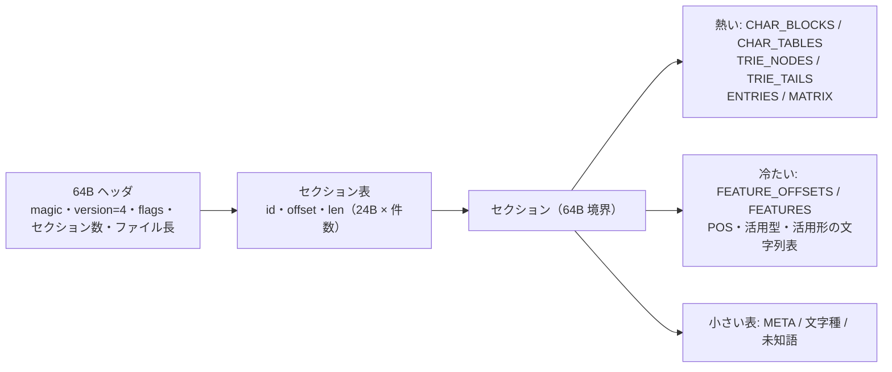

# 辞書形式 (.hsd) の検討記録

hasami の辞書バイナリ形式を v3 から v4 に作り直したとき（2026-09）に、測ったこと・試したこと・
決めたこと・見送ったことをまとめる。次に形式を見直すときの出発点にする。

- 形式の規範（バイト配置と正当性条件）は `src/hsd/*.rs` の冒頭コメントが正。この文書は経緯と数値を残す
- 数値は Apple Silicon の Mac（8 コア）、`cargo build --release`（lto = "fat"）で取った。コーパスは
  livedoor ニュースの本文 14.3 万行（平均 78 字）。高負荷時の計測を含むので、時間は ±10% 程度揺れる

## 1. 目標と前提

| 軸 | 見たもの |
| --- | --- |
| 格納効率 | セクション別のバイト数、エントリ・素性・文字列の重複、冗長な情報（表層形の保存、支配エントリ、範囲外 ID の重複） |
| 読み出し効率 | 共通接頭辞検索の ns/位置、ロードと初回解析の時間・最大 RSS、コーパス全体の解析時間 |
| ファイルサイズ | 配布する 3 辞書（ipadic / ipadic-neologd / ipadic-neologd-sudachi）のサイズ。リリースの添付ファイルとして配るので、利用者のダウンロード量に直結する（`hasami dict download` は zstd で圧縮した版を取る） |
| 安全性 | 壊れた・切り詰められたファイルで未定義動作や panic にならないこと |
| 構築 | 構築時間とピークメモリ（推奨辞書は 480 万キー・500〜780 万エントリ） |

旧形式との互換性は捨てた（v1〜v3 は読まない。読もうとすると `scripts/build-dict.sh` で作り直すよう案内する）。
計測は必ず 3 辞書で行う。ipadic だけでは文字の種類（5,443 → 10,000）やキー数が桁違いで、結論が変わりうる。

## 2. v3 の構成と問題

v3 はバイト単位の double-array trie に、エントリ（16B）・素性（16B、文字列 ID 4 つ）・文字列プールを
組み合わせた形式だった。

| セクション（推奨辞書、742MB） | サイズ | 割合 |
| --- | ---: | ---: |
| trie の base + check（バイト単位、3,318 万スロット） | 265MB | 36% |
| 終端のビット列・rank・値プール | 74MB | 10% |
| エントリ 16B × 782 万 | 125MB | 17% |
| 素性 16B × 462 万 | 74MB | 10% |
| 文字列のオフセット + 本体（うち表層形 97MB） | 200MB | 27% |
| 接続行列（i16 1316×1316） | 3.5MB | 0.5% |

見つかった問題:

1. **表層形を保存していた**。trie のキーと同じ情報で、文字列本体の半分を占めた
2. **全文字列を `Arc<str>` に複製するキャッシュ**。初回の解析で最大 700 万個を複製し、推奨辞書で 0.95 秒・RSS 660MB
3. **バイト単位の trie が深い**。日本語 1 文字 = 3 遷移。推奨辞書で共通接頭辞検索 482.8 ns/位置
4. **範囲外の文脈 ID を検査していなかった**。推奨辞書に SudachiDict の ID のまま混入した重複が 137 万件あり、解析時に
   接続コスト 0 として扱われて不当に勝っていた
5. **支配エントリ**（同じ表層形・同じ文脈 ID でコストが最小でないもの）が推奨辞書の 14.3%
6. **活用型・活用形を捨てていた**。`Token` に出せず、MeCab 形式の書き出しでは `*` になった
7. **ロード時の検査が無い**。`slice::from_raw_parts` で型付きスライスを作り、壊れたファイルで範囲外参照しうる
8. **trie の構築が止まる**。最初の空きスロットが「置けない穴」で止まると、子が 1 つのノードのたびに配列の末尾まで
   走査して、構築がノード数 × 配列長になる（推奨辞書の repair が 10 分超）。スロット 1..=255 を先に埋めて 30 秒に直した
9. **merge・repair で char.def の文字範囲が消える**。辞書を読み込み直すときにカテゴリの既定値しか取り込まず、
   文字範囲を落としてコードに埋め込んだ簡易分類にフォールバックしていた（NEologd を含む配布辞書は長くこの状態だった）
10. **接続行列の向きと名前の取り違え**。matrix.def の 1 行目（「前の語の right_id の数」「次の語の left_id の数」）を
    逆に読んでいた。IPAdic は正方行列なので結果に出なかった

## 3. v4 の構成

| セクション | 中身 |
| --- | --- |
| META | `key=value` 行。`name`・`pos_scheme`（ipadic / unidic）必須。`sources`・`repairs`・`ipadic_patch`・`pruned_dominated`・`zero_matrix` など |
| CHAR_BLOCKS / CHAR_TABLES | 文字 → 符号の 2 段表（`block[cp >> 8]` → 256 要素の表）。符号は出現回数の降順に 1..=N（0 は辞書に無い文字） |
| TRIE_NODES | `{base: u32, check: u32}`。base の上位 2 ビットで INTERNAL / LEAF / TAIL。INTERNAL は bit29 が「ここで終わるキーがある」 |
| TRIE_TAILS | 分岐の無い末尾の鎖（キー 1 つだけの部分木）を `値 u32 + 長さ varint + UTF-8` にまとめたもの |
| ENTRIES | 6B `{left_and_last: u16, right: u16, cost: i16}`。表層形のバイト順に並べ、同じ表層形の並び（群）の最後に印 |
| FEATURE_OFFSETS / FEATURES | エントリごとの素性レコードへのオフセットと、重複を除いた素性レコード（最良パスの語だけ復号する） |
| POS / CONJ_TYPE / CONJ_FORM_STRINGS | 品詞・活用型・活用形の文字列表（ロード時に `Vec<Arc<str>>` へ 1 回だけ実体化） |
| MATRIX | 転置した接続行列 `costs[left_id * num_right + right_id]`（Viterbi の内側が 1 行で完結する向き） |
| CHAR_CATEGORIES / CHAR_RANGES / CATEGORY_NAMES | char.def の完全な内容 |
| UNK_BUCKETS / UNK_TEMPLATES | 文字種ごとの unk.def のテンプレート（無い文字種は既定値を書いておく） |

素性レコードは `品詞 u16, 活用型 u16, 活用形 u16, flags u8, 読み, [発音], [原形]`。flags で「原形 = 表層形」「発音 = 読み」を
表して省き、読み・発音がカタカナだけなら 1 字 1 バイト（`cp - 0x30A0`）に詰める。

検査は 3 段に分けた。

| 時点 | 検査 | 費用 |
| --- | --- | --- |
| ロード | ヘッダ、セクション表（範囲・整列・重なり・重複 id）、メタデータ、文字列表、文字種、未知語、trie の根、行列の寸法 | O(セクション数 + 小さな表)。1〜3ms |
| 解析中 | 群・文脈 ID・素性・varint・UTF-8 の範囲。見つけたら `DictError::Corrupt`（`try_tokenize`）。空文字列でごまかさない | 1 ノードあたり比較数回 |
| `hasami info --verify` | trie の全ノード（親子関係・閉路・到達可能性・TAIL・文字表の全単射）、全キーの検索、全群の印、全素性レコード | 推奨辞書で約 6 秒 |

書き出しは同じディレクトリの一時ファイルに書いてから rename で差し替える（mmap で読んでいる他のプロセスを壊さない）。

## 4. 試したことと結果

### 4.1 trie: バイト単位 → 文字単位

| 構成（推奨辞書、479 万キー） | 構築 | サイズ | 占有率 | 共通接頭辞検索 |
| --- | ---: | ---: | ---: | ---: |
| v3 バイト単位 DA + 終端ビット列 | — | 約 339MB | — | 482.8 ns/位置 |
| 文字単位、BFS 配置、末尾圧縮なし | 258.6s | 116.6MB | 99.9% | 188.6 ns |
| 文字単位、DFS 配置、末尾圧縮なし | 4.8s | 116.6MB | 99.9% | 193.6 ns |
| 文字単位、DFS 配置、末尾圧縮あり（試作） | 36.2s | 88.7MB | 99.5% | 167.6 ns |
| **文字単位、DFS、末尾圧縮あり（採用）** | **3.3〜3.6s** | **88.8MB** | **99.4%** | **169 ns** |

- 心配していた「文字の種類が多いと空きスロットが増える」は起きなかった（符号を出現頻度順に振ると、よく出る文字の子が密に並ぶ）
- **BFS は構築が遅すぎる**（258 秒）。DFS はソート済みのキー区間を再帰的に置くだけで済む
- **子を辿る順序で占有率が変わる**。無駄になるのは構築の終わりに配列の末尾へ残る穴で、漢字の子を先に・仮名の子を後に
  置くと、後半に「符号が小さく範囲が狭いノード」が続いて穴が埋まる

  | 辿る順序 | IPAdic | 推奨辞書 |
  | --- | ---: | ---: |
  | 符号の昇順 | 88.7%（4.4MB） | 97.2%（90.0MB） |
  | 符号の降順 | 86.7%（4.5MB） | 99.7%（88.6MB） |
  | **コードポイントの降順（採用）** | **94.9%（4.1MB）** | **99.4%（88.8MB）** |

- **末尾圧縮を入れると試作の構築が 7 倍遅くなった**。原因は空き探索: 末尾圧縮が「子が 1 つの鎖」を吸収するので穴を
  埋める役がいなくなり、最初の空きと配列の先端の間に 7〜9 割埋まった領域が常に残る。子が複数あるノードは毎回その領域を
  空き 1 つずつ走査していた（1 回あたり 656 位置、末尾なしは 39.7）。候補を 64 個ずつビット演算で調べるようにして 10 倍速くした。
  「子の多いノードを配列の先端から探す」近道は占有率が 63〜80% に落ちたのでやめた
- 空き探索が止まる対策: スロット 1..=N（N = 符号の最大値）を先に予約する（置けない穴で探索開始位置が止まらない）。
  子が複数あるノードの探索開始位置は、走査区間の 95% 以上が埋まっていれば先へ進める
- 検索が `Result` を返す費用: 最初は IPAdic で 10〜17% 遅くなった。末尾レコードの読み出しを `#[inline(always)]` にし、
  エラーの組み立てを cold 関数に寄せて 3〜5% に抑えた

### 4.2 エントリと素性

| 項目 | v3 | v4 |
| --- | --- | --- |
| エントリ | 16B（表層形 ID・素性 ID・左右 ID・コスト） | 6B（左 ID 15 ビット + 群の最後の印・右 ID・コスト） |
| 表層形 | 文字列プールに保存 | 保存しない（解析時は入力の部分文字列、export は trie から復元） |
| 素性 | 16B（品詞・原形・読み・発音の文字列 ID） | 可変長レコードを重複排除（原形・発音は省略可、カタカナは 1 字 1 バイト） |
| 活用型・活用形 | 捨てていた | 文字列表の番号で保持し `Token` に出す |
| トークン生成 | 全文字列の `Arc<str>` キャッシュを clone | 最良パスの語だけ復号。品詞・活用は表の `Arc` を clone。よく出る語の文字列は解析器ごとの小さなキャッシュ（6 章） |

見送ったもの:

- **原形・発音の差分符号化**（表層形・読みとの共通部分を省く）: 見積もりで効果が小さく、トークン生成が複雑になる
- **文脈 ID のコーパス頻度による再付番**: 行列のキャッシュ効率の改善が IPAdic で 4% 程度の見込み

### 4.3 支配エントリの除去（`--prune-dominated`）

同じ表層形・同じ (left_id, right_id) のうちコスト最小（同コストなら先頭）だけを残す。Viterbi は `total < best` の先勝ちで、
同じ文脈 ID なら接続コストも同じなので、除いた側が最良パスに選ばれることはない。残す側を元の位置に置いたままにすれば、
文脈 ID の違う候補との同点の勝ち負けも変わらない（コーパス 14.3 万行で除去前後の解析結果が完全一致）。

| 辞書（最終の配布辞書） | 除けるエントリ | サイズ |
| --- | ---: | ---: |
| ipadic | 13,202（3.4%） | -1.7% |
| ipadic-neologd | 128,297（2.8%） | -1.2% |
| ipadic-neologd-sudachi | 130,360（2.6%） | -1.1% |

解析時間は ipadic-neologd で約 1% 速くなった。

除いた辞書は、repair で支配する側のエントリを消したときに代わりの候補がもう無い（誤読エントリを消して正しい読みの
エントリに譲る、という使い方ができない）。そのため除去済みの辞書は merge・repair の入力にできないようにした。
効果が小さいので**配布辞書には掛けていない**（利用者が配布辞書に merge・repair できる方を優先した）。
旧推奨辞書で 14.3% あった支配エントリの大半は SudachiDict の旧変換の重複で、変換をやり直した今は 2.6% しかない。

### 4.4 読み込み側

- **Mmap / InMemory の二重実装をやめた**。メモリ上の辞書（テスト・Python の `DictBuilder`）も v4 のバイト列を作って
  同じリーダーで読む（8 バイト境界の `Vec<u64>` に置く）
- 実行ファイルに埋め込んだ辞書（`'static` のバイト列）も、複製せずに同じリーダーで読む（`Dictionary::from_static`、
  Issue #8）。先頭が 8 バイト境界になければエラーにし、`include_hsd!` が 64 バイト境界にそろえて埋め込む。
  `from_bytes` の複製（IPAdic で 18MB）がなくなり、起動が約 6ms 速く、最大 RSS が約 31MB 減った（mmap と同じ）
- 型付きスライスは `bytemuck::try_cast_slice` でロード時に長さと整列を確かめ、解析中は検査済みの位置から作り直す
- セクションの位置を `HashMap` で引いていたら、プロファイルで解析時間の約 4% を占めた。id で引く固定長配列にした
- ビッグエンディアン機はロードを拒否する（型付きスライスの cast はバイト順を変えないため）

### 4.5 Viterbi

v3 と同じ（ノードごとに前の語を全部回す）。IPAdic + NEologd でコーパスを解析したプロファイル（`sample`、出力の書式化を含む）では、
trie の検索・ラティス構築・Viterbi をまとめた解析関数がサンプルの約 4 割を占め、次いで出力の書式化と書き込み、
メモリの確保・解放（トークンの文字列）、素性レコードの復号だった。次に効くのは解析関数の中身で、
開始位置ごとに前の語を right_id 単位で最小に集約し、(位置, left_id) ごとに行列を 1 回引く方式を候補として残した
（未実装。辞書が大きいほど同じ right_id の候補が重なるので効く見込み）。

その後（2026-09）、ラティスの構築と Viterbi を 1 回の走査にまとめ（ノードを作るときに最良の前ノードを決める）、
集約は測ったうえで見送った。反復は 13〜27% 減るが、表を引く費用の方が大きい。経緯と数値は [performance.md](performance.md)。

## 5. 回帰確認

| 比較 | 結果 |
| --- | --- |
| 同じ上流・同じ処理の v3 と v4（IPAdic） | 534 万トークンで完全一致（表層形・位置・品詞・原形・読み・発音・単語コスト・既知/未知） |
| 同じ上流・同じ処理の v3 と v4（IPAdic + NEologd） | 491 万トークンで完全一致 |
| v4 の除去なし と 除去あり（IPAdic + NEologd） | 完全一致 |
| 活用型・活用形 | 上流 CSV → v4 → export → 読み戻しの往復（テスト） |
| 壊れたファイル | 版・magic・長さ・予約領域・重複 id・重なり・件数の不一致・範囲外参照をそれぞれ拒否。ランダムなビット反転 2,000 回で panic しない |

v3 との比較は、形式の差と中身の差を分けた。v3 の merge・repair は char.def の文字範囲を落としていたので、NEologd の比較には
char.def なしで作った v4 を使った。

## 6. 最終の計測

`scripts/build-dict.sh` で作り直した配布辞書と、作り直す前の配布辞書（v3）の比較。MB は MiB。

| 辞書 | 形式 | サイズ | 初回解析（wall / 最大 RSS） | コーパス 14.3 万行（wall / 最大 RSS） | bench 短文 / 長文 |
| --- | --- | ---: | ---: | ---: | ---: |
| ipadic | v3 | 36.2MB | 0.12s / 42MB | 12.9s / 70MB | 10.5µs / 30.6µs |
| ipadic | **v4** | **17.3MB** | **0.01s / 4MB** | 12.4〜12.9s / **22MB** | **9.4µs / 27.1µs** |
| ipadic-neologd | v3 | 590.7MB | 1.33s / 579MB | 21.0s / 972MB | 10.6µs / 32.9µs |
| ipadic-neologd | **v4** | **211.9MB** | **0.01s / 4MB** | **13.7〜14.0s / 195MB** | **9.7µs / 27.8µs** |
| ipadic-neologd-sudachi | v3 | 666.8MB | 1.43s / 629MB | 34.3s / 1078MB | 58.6µs / 96.4µs |
| ipadic-neologd-sudachi | **v4** | **227.2MB** | **0.01s / 4MB** | **14.2〜14.3s / 209MB** | **9.7µs / 25.2µs** |

- 初回解析: `hasami tokenize` で 1 文。v3 は全文字列の `Arc<str>` キャッシュを作るため秒単位だった
- コーパス: 全トークンの全フィールドを TSV で書き出す計測用プログラム（出力の書式化を含む）
- bench: `hasami bench` で同じ文を繰り返す（短文 2 万回・長文 5,000 回）。辞書のページが全部温まった状態
- 計測中のマシンの負荷平均は 16〜20（ほかの作業が動いていた）。絶対値は揺れるので、同じ時間帯に並べた値で比べた
- 推奨辞書の v3 と v4 は中身も違う（SudachiDict の変換をやり直した）。v3 が遅かったのは範囲外 ID の重複と支配エントリで候補が膨らんでいたため

**トークン生成の確保**: v3 はトークンの文字列を全部キャッシュから clone していたので、キャッシュをやめた直後の v4 は
同じ文を繰り返す bench で 10〜15% 遅かった（プロファイルで malloc/free が約 16%、素性の復号が約 7%）。codex に相談して 2 段で直した。

1. 読み・発音の復号を解析器ごとの再利用バッファに書いてから `Arc<str>` を 1 回だけ確保する（String を経由すると確保 2 回・解放 1 回）。12.0 → 11.6µs
2. 解析器（`LatticeWorkspace`）ごとに、辞書エントリの番号 → トークンの文字列一式の直接マップ方式のキャッシュ（1024 スロット、
   表層形 64 バイト以下の語だけ、辞書ごとの一意な番号で無効化）。11.6 → 9.4µs。解析器ごとに独立しているのでロックは要らない。
   文脈による読みの補正はキャッシュから作ったトークンに対して行い、キャッシュには戻さない

見送ったもの（codex と相談）: `end_nodes`（位置ごとの `Vec<Vec<u32>>`）を連結リストにする変更と、Viterbi の集約は、
位置ごとの前ノード数・異なる right_id 数を数えてから判断する（2026-09 に数えて判断した。[performance.md](performance.md)）。

構築: 3 辞書の作り直し（取得済み、SudachiDict の変換 3 分を含む）が約 5 分、最大 RSS 約 3GB。
`hasami info --verify` は 0.2s / 3.9s / 4.5s。

## 7. 形式の外で見つかった問題

形式を作り直す過程で、辞書データや文字分類の問題がいくつか見つかった。

| 問題 | 対処 |
| --- | --- |
| merge・repair が char.def の文字範囲を落としていた（2 章の 9） | v4 は取り込み時に char.def を丸ごと引き継ぐ。その結果、NEologd を含む辞書の記号の扱いが IPAdic 単体と同じ（char.def どおり）になった |
| IPAdic の char.def は `— 。 、 「 ♪ ⇒` などを SYMBOL（まとめて 1 語）にし、unk.def はその未知語を「名詞,サ変接続」（コスト 17585）にする。辞書に無い記号の並びが句点ごと 1 つの名詞になる（「楽しみたい——。」の「——。」） | `scripts/prepare_ipadic.py` が配布辞書用に SYMBOL を `0 0 0`（既知語がある位置では作らない・1 文字ずつ）と「記号,一般」（5,5,4769）に変える。MeCab 互換を崩すのはこの 1 か所だけにした |
| IPAdic の CSV は EUC-JP で、ダッシュ・波ダッシュ・マイナスなど 7 字は変換表で写し先が分かれる。encoding_rs（WHATWG）は Windows（CP932）と同じ「―」「～」「－」に写すので、JIS 側の字（「—」「〜」「−」）で書かれた文章に当たらない（コーパスでは U+2014 が 4,723 回、U+2015 は 0 回） | `DictBuilder::decode_to_utf8` が JIS の対応表（iconv・MeCab と同じ）にそろえ、`prepare_ipadic.py` が Windows 側の字の別表記を表層形に足す（33 語） |
| JIS 側にそろえると IPAdic の「−（ヒク）」が引けるようになり、ハイフン代わりの「K−POP」が「ケーヒクポップ」になる（「−」706 回のうち引き算らしいのは 57 回） | `dict/user-remove/misreading-entries.csv` で落とす（NEologd を含む 2 辞書） |
| repair の発音の修復が、読みも発音もカタカナでない語を一律に空にしていたので、句読点・括弧の読み（「。」→「。」）まで消えていた（以前の配布辞書は発音の修復を掛けずに作っていたので残っていた） | 品詞が「記号」の語は変えない（MeCab・OpenJTalk と同じく記号そのものを読みに持つ）。ラテン文字の読みは従来どおり空にして綴り読みに任せる |
| char.def の範囲が重なるとき、MeCab は後の行が勝つが、hasami は開始位置が大きい範囲が勝つ（「々」は MeCab では SYMBOL、hasami では KANJI） | hasami の規則のまま（漢字の繰り返し記号として自然）。ただし、範囲の中に別の範囲があるとその後ろの文字が包む範囲に属さない不具合があった（IPAdic の英字の範囲 0x00C0..0x00FF の中の 0x00D0 SPACE のため é ñ ü が英字にならず「Pok/é/mon」に割れた）ので、2026-09 に「文字を含む範囲のうち開始位置が最も大きいもの（同じなら後の行）」に直した |
| char.def の group=1 と length=N の組み合わせ。MeCab は「同じ種類の文字の並び全体」と「N 文字までの接頭辞」を候補にするが、hasami は並びを N 文字で打ち切った 1 つだけを作っていた | 2026-09 に MeCab と同じにした（1 文字の未知語は候補にも既知語にも無いときだけ）。IPAdic で MeCab と分かち書きが一致する行が 64.7% から 88.5% に上がった（「ブ / ログ」→「ブログ」）。`prepare_ipadic.py` が HIRAGANA を 0 0 2、ALPHA・NUMERIC を 1 1 1 にし、中黒と × ÷ を SYMBOL にする（ひらがなの並びを 1 語にしない、英数字を 1 文字にも分けられる、カタカナ・英字の並びを切る） |
| MeCab と同じ候補にすると、単語コストが一律（9461）のカタカナの並び全体の未知語が、既知語 2 語以上の複合語に勝つ（「オススメ / アプリ」→「オススメアプリ」が推奨辞書のニュース 13 万行で 9,787 か所）。単語コストの高い既知語（「キャンプ」16437）も未知語に負ける。MeCab は並びが 25 字を超えると並び全体を候補にしないので、32 字の英字の ID が 1 字ずつに割れる | カタカナの並び全体の候補（3 字以上）は、3 字以上の既知語を隙間なく並べて覆えるなら作らない（並びの境界をまたぐ語も数える。2 字の語まで数えると人名が断片に割れる）。最良パスに残ったカタカナの未知語と同じ表層の語が辞書にあれば、その語の素性で出す。並び全体の候補は長さによらず作る。9,787 か所が 5,528 か所になり、IPAdic で MeCab と一致する行は 87.7%（README の「未知語」）。一律のコストの上乗せ、境界をまたぐ既知語があるだけで候補を消す規則、既知語の単語コストを未知語の値で頭打ちにする規則も試したが、良い併合（「ア / プリ」→「アプリ」）が先に戻る・表記ゆれのエントリ（「公キ」原形「公器」）で誤作動する・同じ表層の接尾辞のエントリが勝つ（「ツー / タッチ」）ので見送った |
| 半角空白・タブ・改行を未知語の SPACE（記号,空白）のノードにしていたので、後ろの語が 記号,空白 の右文脈からつながり、IPAdic では接続詞になりやすかった（「データを CSV で出力する」の「で」。Issue #5）。MeCab は SPACE の文字を読み飛ばす | MeCab と同じく読み飛ばし、空白の後ろから始まる語を空白の前の位置につなぐ（`Node::start` はつなぐ位置、表層は空白の後ろから）。空白はトークンにしない。IPAdic の char.def は SPACE に `0x00D0`（Ð）を入れていて（復帰 `0x000D` の書き間違い）、そのままだと Ð が消えるので `prepare_ipadic.py` が直す。IPAdic で MeCab と一致する行は 87.71% → 87.78% |
| 未知語の品詞を文字種ごとの先頭のテンプレート（名詞,一般）1 つで決めていた。IPAdic の unk.def は英字・カタカナ・漢字・ひらがなに 6〜7 個のテンプレート（固有名詞の地域・組織・人名・一般、感動詞など）を持ち、MeCab は未知語の候補ごとにテンプレートの数だけノードを作る（「Zoom」は 名詞,固有名詞,組織。Issue #6）。v4 の形式は文字種ごとの全テンプレートを持っていたが、読み込みが先頭だけを使っていた | 読み込みで全テンプレートを unk.def の順に持ち、候補ごとにテンプレートの数だけノードを作る（`Node::entry` はテンプレートの番号）。形式は変えない。IPAdic で MeCab と語の範囲と品詞が一致する割合は 96.60% → 97.68%、行単位の一致は 87.78% → 87.86%。前ノードの走査が 1.73 億 → 3.23 億回に増え、解析の時間は約 15% 増えた（[performance.md](performance.md) の 3 章に試したこと） |
| 全角の「％」は IPAdic の 名詞,接尾,助数詞 の語だが、半角の `%` と `‰` `℃` `°`、CJK 互換文字の単位（`㎏` `㎞` `㌢` `㍍`）は辞書に無く、未知の記号（記号,一般。MeCab では 名詞,サ変接続）になる（Issue #7） | `prepare_ipadic.py` が「％」の行を手本に、同じ品詞・文脈 ID・コストの語を読み付きで足す（181 語。カタカナの組文字の読みは NFKC の形、ラテン文字の組文字は単位の読みの表）。`CoarsePos` は表層形でも `NounSuffix` にする |

## 8. 次に検討すること

- ~~Viterbi の集約（4.5）~~ 測って見送った（[performance.md](performance.md)）
- 構築のピークメモリ。推奨辞書の repair は最大 RSS 約 3GB（全エントリを `Arc<str>` 10 個の `DictEntry` で持つため）。
  品詞・活用は共有しているが、表層形・読み・原形は 1 件ずつ確保している
- 配布辞書に支配エントリの除去を掛けるかどうか（4.3）。merge・repair との両立の仕方を決めてから
