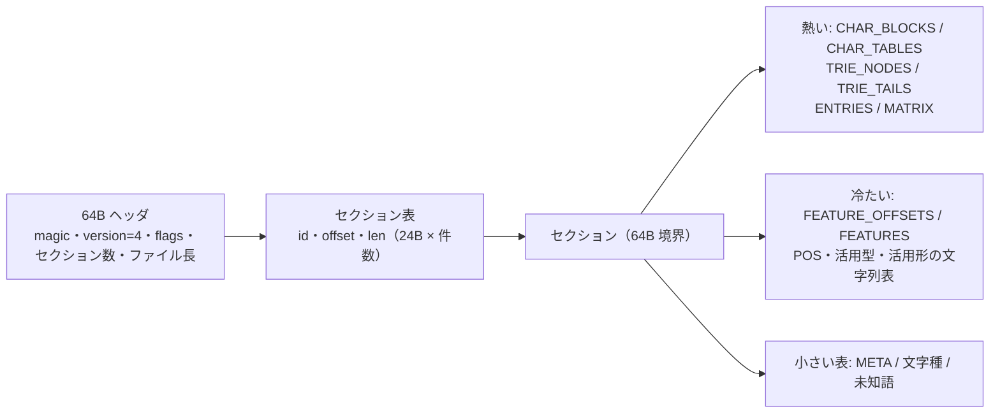

# 辞書形式 (.hsd) の検討記録

hasami の辞書バイナリ形式を v3 から v4 に作り直したとき（2026-09）に、測ったこと・試したこと・
決めたこと・見送ったことをまとめる。第 9 節以降には、その後の見直しも日付付きで残す。
次に形式を見直すときの出発点にする。

- 形式の規範（バイト配置と正当性条件）は `src/hsd/*.rs` の冒頭コメントが正。この文書は経緯と数値を残す
- 数値は Apple Silicon の Mac（8 コア）、`cargo build --release`（lto = "fat"）で取った。コーパスは
  livedoor ニュースの本文 14.3 万行（平均 78 字）。高負荷時の計測を含むので、時間は ±10% 程度揺れる

## 1. 目標と前提

| 軸 | 見たもの |
| --- | --- |
| 格納効率 | セクション別のバイト数、エントリ・素性・文字列の重複、冗長な情報（表層形の保存、支配エントリ、範囲外 ID の重複） |
| 読み出し効率 | 共通接頭辞検索の ns/位置、ロードと初回解析の時間・最大 RSS、コーパス全体の解析時間 |
| ファイルサイズ | 配布する 3 辞書（ipadic / ipadic-neologd / ipadic-neologd-sudachi）のサイズ。リリースの添付ファイルとして配るので、利用者のダウンロード量に直結する（`hasami dict download` は zstd で圧縮した版を取る） |
| 安全性 | 壊れた・切り詰められたファイルで未定義動作や panic にならないこと |
| 構築 | 構築時間とピークメモリ（推奨辞書は 480 万キー・500〜780 万エントリ） |

旧形式との互換性は捨てた（v1〜v3 は読まない。読もうとすると `scripts/build-dict.sh` で作り直すよう案内する）。
計測は必ず 3 辞書で行う。ipadic だけでは文字の種類（5,443 → 10,000）やキー数が桁違いで、結論が変わりうる。

## 2. v3 の構成と問題

v3 はバイト単位の double-array trie に、エントリ（16B）・素性（16B、文字列 ID 4 つ）・文字列プールを
組み合わせた形式だった。

| セクション（推奨辞書、742MB） | サイズ | 割合 |
| --- | ---: | ---: |
| trie の base + check（バイト単位、3,318 万スロット） | 265MB | 36% |
| 終端のビット列・rank・値プール | 74MB | 10% |
| エントリ 16B × 782 万 | 125MB | 17% |
| 素性 16B × 462 万 | 74MB | 10% |
| 文字列のオフセット + 本体（うち表層形 97MB） | 200MB | 27% |
| 接続行列（i16 1316×1316） | 3.5MB | 0.5% |

見つかった問題:

1. **表層形を保存していた**。trie のキーと同じ情報で、文字列本体の半分を占めた
2. **全文字列を `Arc<str>` に複製するキャッシュ**。初回の解析で最大 700 万個を複製し、推奨辞書で 0.95 秒・RSS 660MB
3. **バイト単位の trie が深い**。日本語 1 文字 = 3 遷移。推奨辞書で共通接頭辞検索 482.8 ns/位置
4. **範囲外の文脈 ID を検査していなかった**。推奨辞書に SudachiDict の ID のまま混入した重複が 137 万件あり、解析時に
   接続コスト 0 として扱われて不当に勝っていた
5. **支配エントリ**（同じ表層形・同じ文脈 ID でコストが最小でないもの）が推奨辞書の 14.3%
6. **活用型・活用形を捨てていた**。`Token` に出せず、MeCab 形式の書き出しでは `*` になった
7. **ロード時の検査が無い**。`slice::from_raw_parts` で型付きスライスを作り、壊れたファイルで範囲外参照しうる
8. **trie の構築が止まる**。最初の空きスロットが「置けない穴」で止まると、子が 1 つのノードのたびに配列の末尾まで
   走査して、構築がノード数 × 配列長になる（推奨辞書の repair が 10 分超）。スロット 1..=255 を先に埋めて 30 秒に直した
9. **merge・repair で char.def の文字範囲が消える**。辞書を読み込み直すときにカテゴリの既定値しか取り込まず、
   文字範囲を落としてコードに埋め込んだ簡易分類にフォールバックしていた（NEologd を含む配布辞書は長くこの状態だった）
10. **接続行列の向きと名前の取り違え**。matrix.def の 1 行目（「前の語の right_id の数」「次の語の left_id の数」）を
    逆に読んでいた。IPAdic は正方行列なので結果に出なかった

## 3. v4 の構成


```mermaid
flowchart LR
    H["64B ヘッダ<br/>magic・version=4・flags・セクション数・ファイル長"] --> T["セクション表<br/>id・offset・len（24B × 件数）"]
    T --> S["セクション（64B 境界）"]
    S --> HOT["熱い: CHAR_BLOCKS / CHAR_TABLES<br/>TRIE_NODES / TRIE_TAILS<br/>ENTRIES / MATRIX"]
    S --> COLD["冷たい: FEATURE_OFFSETS / FEATURES<br/>POS・活用型・活用形の文字列表"]
    S --> SMALL["小さい表: META / 文字種 / 未知語"]
```

| セクション | 中身 |
| --- | --- |
| META | `key=value` 行。`name`・`pos_scheme`（ipadic / unidic）必須。`sources`・`repairs`・`ipadic_patch`・`pruned_dominated`・`zero_matrix` など |
| CHAR_BLOCKS / CHAR_TABLES | 文字 → 符号の 2 段表（`block[cp >> 8]` → 256 要素の表）。符号は出現回数の降順に 1..=N（0 は辞書に無い文字） |
| TRIE_NODES | `{base: u32, check: u32}`。base の上位 2 ビットで INTERNAL / LEAF / TAIL。INTERNAL は bit29 が「ここで終わるキーがある」 |
| TRIE_TAILS | 分岐の無い末尾の鎖（キー 1 つだけの部分木）を `値 u32 + 長さ varint + UTF-8` にまとめたもの |
| ENTRIES | 6B `{left_and_last: u16, right: u16, cost: i16}`。表層形のバイト順に並べ、同じ表層形の並び（群）の最後に印 |
| FEATURE_OFFSETS / FEATURES | エントリごとの素性レコードへのオフセットと、重複を除いた素性レコード（最良パスの語だけ復号する） |
| POS / CONJ_TYPE / CONJ_FORM_STRINGS | 品詞・活用型・活用形の文字列表（ロード時に `Vec<Arc<str>>` へ 1 回だけ実体化） |
| MATRIX | 転置した接続行列 `costs[left_id * num_right + right_id]`（Viterbi の内側が 1 行で完結する向き） |
| CHAR_CATEGORIES / CHAR_RANGES / CATEGORY_NAMES | char.def の完全な内容 |
| UNK_BUCKETS / UNK_TEMPLATES | 文字種ごとの unk.def のテンプレート（無い文字種は既定値を書いておく） |

素性レコードは `品詞 u16, 活用型 u16, 活用形 u16, flags u8, 読み, [発音], [原形]`。flags で「原形 = 表層形」「発音 = 読み」を
表して省き、読み・発音がカタカナだけなら 1 字 1 バイト（`cp - 0x30A0`）に詰める。

検査は 3 段に分けた。

| 時点 | 検査 | 費用 |
| --- | --- | --- |
| ロード | ヘッダ、セクション表（範囲・整列・重なり・重複 id）、メタデータ、文字列表、文字種、未知語、trie の根、行列の寸法 | O(セクション数 + 小さな表)。1〜3ms |
| 解析中 | 群・文脈 ID・素性・varint・UTF-8 の範囲。見つけたら `DictError::Corrupt`（`try_tokenize`）。空文字列でごまかさない | 1 ノードあたり比較数回 |
| `hasami info --verify` | trie の全ノード（親子関係・閉路・到達可能性・TAIL・文字表の全単射）、全キーの検索、全群の印、全素性レコード | 推奨辞書で約 6 秒 |

書き出しは同じディレクトリの一時ファイルに書いてから rename で差し替える（mmap で読んでいる他のプロセスを壊さない）。

## 4. 試したことと結果

### 4.1 trie: バイト単位 → 文字単位

| 構成（推奨辞書、479 万キー） | 構築 | サイズ | 占有率 | 共通接頭辞検索 |
| --- | ---: | ---: | ---: | ---: |
| v3 バイト単位 DA + 終端ビット列 | — | 約 339MB | — | 482.8 ns/位置 |
| 文字単位、BFS 配置、末尾圧縮なし | 258.6s | 116.6MB | 99.9% | 188.6 ns |
| 文字単位、DFS 配置、末尾圧縮なし | 4.8s | 116.6MB | 99.9% | 193.6 ns |
| 文字単位、DFS 配置、末尾圧縮あり（試作） | 36.2s | 88.7MB | 99.5% | 167.6 ns |
| **文字単位、DFS、末尾圧縮あり（採用）** | **3.3〜3.6s** | **88.8MB** | **99.4%** | **169 ns** |

- 心配していた「文字の種類が多いと空きスロットが増える」は起きなかった（符号を出現頻度順に振ると、よく出る文字の子が密に並ぶ）
- **BFS は構築が遅すぎる**（258 秒）。DFS はソート済みのキー区間を再帰的に置くだけで済む
- **子を辿る順序で占有率が変わる**。無駄になるのは構築の終わりに配列の末尾へ残る穴で、漢字の子を先に・仮名の子を後に
  置くと、後半に「符号が小さく範囲が狭いノード」が続いて穴が埋まる

  | 辿る順序 | IPAdic | 推奨辞書 |
  | --- | ---: | ---: |
  | 符号の昇順 | 88.7%（4.4MB） | 97.2%（90.0MB） |
  | 符号の降順 | 86.7%（4.5MB） | 99.7%（88.6MB） |
  | **コードポイントの降順（採用）** | **94.9%（4.1MB）** | **99.4%（88.8MB）** |

- **末尾圧縮を入れると試作の構築が 7 倍遅くなった**。原因は空き探索: 末尾圧縮が「子が 1 つの鎖」を吸収するので穴を
  埋める役がいなくなり、最初の空きと配列の先端の間に 7〜9 割埋まった領域が常に残る。子が複数あるノードは毎回その領域を
  空き 1 つずつ走査していた（1 回あたり 656 位置、末尾なしは 39.7）。候補を 64 個ずつビット演算で調べるようにして 10 倍速くした。
  「子の多いノードを配列の先端から探す」近道は占有率が 63〜80% に落ちたのでやめた
- 空き探索が止まる対策: スロット 1..=N（N = 符号の最大値）を先に予約する（置けない穴で探索開始位置が止まらない）。
  子が複数あるノードの探索開始位置は、走査区間の 95% 以上が埋まっていれば先へ進める
- 検索が `Result` を返す費用: 最初は IPAdic で 10〜17% 遅くなった。末尾レコードの読み出しを `#[inline(always)]` にし、
  エラーの組み立てを cold 関数に寄せて 3〜5% に抑えた

### 4.2 エントリと素性

| 項目 | v3 | v4 |
| --- | --- | --- |
| エントリ | 16B（表層形 ID・素性 ID・左右 ID・コスト） | 6B（左 ID 15 ビット + 群の最後の印・右 ID・コスト） |
| 表層形 | 文字列プールに保存 | 保存しない（解析時は入力の部分文字列、export は trie から復元） |
| 素性 | 16B（品詞・原形・読み・発音の文字列 ID） | 可変長レコードを重複排除（原形・発音は省略可、カタカナは 1 字 1 バイト） |
| 活用型・活用形 | 捨てていた | 文字列表の番号で保持し `Token` に出す |
| トークン生成 | 全文字列の `Arc<str>` キャッシュを clone | 最良パスの語だけ復号。品詞・活用は表の `Arc` を clone。よく出る語の文字列は解析器ごとの小さなキャッシュ（6 章） |

見送ったもの:

- **原形・発音の差分符号化**（表層形・読みとの共通部分を省く）: 見積もりで効果が小さく、トークン生成が複雑になる
- **文脈 ID のコーパス頻度による再付番**: 行列のキャッシュ効率の改善が IPAdic で 4% 程度の見込み

### 4.3 支配エントリの除去（`--prune-dominated`）

同じ表層形・同じ (left_id, right_id) のうちコスト最小（同コストなら先頭）だけを残す。Viterbi は `total < best` の先勝ちで、
同じ文脈 ID なら接続コストも同じなので、除いた側が最良パスに選ばれることはない。残す側を元の位置に置いたままにすれば、
文脈 ID の違う候補との同点の勝ち負けも変わらない（コーパス 14.3 万行で除去前後の解析結果が完全一致）。

| 辞書（最終の配布辞書） | 除けるエントリ | サイズ |
| --- | ---: | ---: |
| ipadic | 13,202（3.4%） | -1.7% |
| ipadic-neologd | 128,297（2.8%） | -1.2% |
| ipadic-neologd-sudachi | 130,360（2.6%） | -1.1% |

解析時間は ipadic-neologd で約 1% 速くなった。

除いた辞書は、repair で支配する側のエントリを消したときに代わりの候補がもう無い（誤読エントリを消して正しい読みの
エントリに譲る、という使い方ができない）。そのため除去済みの辞書は merge・repair の入力にできないようにした。
効果が小さいので**配布辞書には掛けていない**（利用者が配布辞書に merge・repair できる方を優先した）。
旧推奨辞書で 14.3% あった支配エントリの大半は SudachiDict の旧変換の重複で、変換をやり直した今は 2.6% しかない。

### 4.4 読み込み側

- **Mmap / InMemory の二重実装をやめた**。メモリ上の辞書（テスト・Python の `DictBuilder`）も v4 のバイト列を作って
  同じリーダーで読む（8 バイト境界の `Vec<u64>` に置く）
- 実行ファイルに埋め込んだ辞書（`'static` のバイト列）も、複製せずに同じリーダーで読む（`Dictionary::from_static`、
  Issue #8）。先頭が 8 バイト境界になければエラーにし、`include_hsd!` が 64 バイト境界にそろえて埋め込む。
  `from_bytes` の複製（IPAdic で 18MB）がなくなり、起動が約 6ms 速く、最大 RSS が約 31MB 減った（mmap と同じ）
- 型付きスライスは `bytemuck::try_cast_slice` でロード時に長さと整列を確かめ、解析中は検査済みの位置から作り直す
- セクションの位置を `HashMap` で引いていたら、プロファイルで解析時間の約 4% を占めた。id で引く固定長配列にした
- ビッグエンディアン機はロードを拒否する（型付きスライスの cast はバイト順を変えないため）

### 4.5 Viterbi

v3 と同じ（ノードごとに前の語を全部回す）。IPAdic + NEologd でコーパスを解析したプロファイル（`sample`、出力の書式化を含む）では、
trie の検索・ラティス構築・Viterbi をまとめた解析関数がサンプルの約 4 割を占め、次いで出力の書式化と書き込み、
メモリの確保・解放（トークンの文字列）、素性レコードの復号だった。次に効くのは解析関数の中身で、
開始位置ごとに前の語を right_id 単位で最小に集約し、(位置, left_id) ごとに行列を 1 回引く方式を候補として残した
（未実装。辞書が大きいほど同じ right_id の候補が重なるので効く見込み）。

その後（2026-09）、ラティスの構築と Viterbi を 1 回の走査にまとめ（ノードを作るときに最良の前ノードを決める）、
集約は測ったうえで見送った。反復は 13〜27% 減るが、表を引く費用の方が大きい。経緯と数値は [performance.md](performance.md)。

## 5. 回帰確認

| 比較 | 結果 |
| --- | --- |
| 同じ上流・同じ処理の v3 と v4（IPAdic） | 534 万トークンで完全一致（表層形・位置・品詞・原形・読み・発音・単語コスト・既知/未知） |
| 同じ上流・同じ処理の v3 と v4（IPAdic + NEologd） | 491 万トークンで完全一致 |
| v4 の除去なし と 除去あり（IPAdic + NEologd） | 完全一致 |
| 活用型・活用形 | 上流 CSV → v4 → export → 読み戻しの往復（テスト） |
| 壊れたファイル | 版・magic・長さ・予約領域・重複 id・重なり・件数の不一致・範囲外参照をそれぞれ拒否。ランダムなビット反転 2,000 回で panic しない |

v3 との比較は、形式の差と中身の差を分けた。v3 の merge・repair は char.def の文字範囲を落としていたので、NEologd の比較には
char.def なしで作った v4 を使った。

## 6. 最終の計測

`scripts/build-dict.sh` で作り直した配布辞書と、作り直す前の配布辞書（v3）の比較。MB は MiB。

| 辞書 | 形式 | サイズ | 初回解析（wall / 最大 RSS） | コーパス 14.3 万行（wall / 最大 RSS） | bench 短文 / 長文 |
| --- | --- | ---: | ---: | ---: | ---: |
| ipadic | v3 | 36.2MB | 0.12s / 42MB | 12.9s / 70MB | 10.5µs / 30.6µs |
| ipadic | **v4** | **17.3MB** | **0.01s / 4MB** | 12.4〜12.9s / **22MB** | **9.4µs / 27.1µs** |
| ipadic-neologd | v3 | 590.7MB | 1.33s / 579MB | 21.0s / 972MB | 10.6µs / 32.9µs |
| ipadic-neologd | **v4** | **211.9MB** | **0.01s / 4MB** | **13.7〜14.0s / 195MB** | **9.7µs / 27.8µs** |
| ipadic-neologd-sudachi | v3 | 666.8MB | 1.43s / 629MB | 34.3s / 1078MB | 58.6µs / 96.4µs |
| ipadic-neologd-sudachi | **v4** | **227.2MB** | **0.01s / 4MB** | **14.2〜14.3s / 209MB** | **9.7µs / 25.2µs** |

- 初回解析: `hasami tokenize` で 1 文。v3 は全文字列の `Arc<str>` キャッシュを作るため秒単位だった
- コーパス: 全トークンの全フィールドを TSV で書き出す計測用プログラム（出力の書式化を含む）
- bench: `hasami bench` で同じ文を繰り返す（短文 2 万回・長文 5,000 回）。辞書のページが全部温まった状態
- 計測中のマシンの負荷平均は 16〜20（ほかの作業が動いていた）。絶対値は揺れるので、同じ時間帯に並べた値で比べた
- 推奨辞書の v3 と v4 は中身も違う（SudachiDict の変換をやり直した）。v3 が遅かったのは範囲外 ID の重複と支配エントリで候補が膨らんでいたため

**トークン生成の確保**: v3 はトークンの文字列を全部キャッシュから clone していたので、キャッシュをやめた直後の v4 は
同じ文を繰り返す bench で 10〜15% 遅かった（プロファイルで malloc/free が約 16%、素性の復号が約 7%）。codex に相談して 2 段で直した。

1. 読み・発音の復号を解析器ごとの再利用バッファに書いてから `Arc<str>` を 1 回だけ確保する（String を経由すると確保 2 回・解放 1 回）。12.0 → 11.6µs
2. 解析器（`LatticeWorkspace`）ごとに、辞書エントリの番号 → トークンの文字列一式の直接マップ方式のキャッシュ（1024 スロット、
   表層形 64 バイト以下の語だけ、辞書ごとの一意な番号で無効化）。11.6 → 9.4µs。解析器ごとに独立しているのでロックは要らない。
   文脈による読みの補正はキャッシュから作ったトークンに対して行い、キャッシュには戻さない

見送ったもの（codex と相談）: `end_nodes`（位置ごとの `Vec<Vec<u32>>`）を連結リストにする変更と、Viterbi の集約は、
位置ごとの前ノード数・異なる right_id 数を数えてから判断する（2026-09 に数えて判断した。[performance.md](performance.md)）。

構築: 3 辞書の作り直し（取得済み、SudachiDict の変換 3 分を含む）が約 5 分、最大 RSS 約 3GB。
`hasami info --verify` は 0.2s / 3.9s / 4.5s。

## 7. 形式の外で見つかった問題

形式を作り直す過程で、辞書データや文字分類の問題がいくつか見つかった。

| 問題 | 対処 |
| --- | --- |
| merge・repair が char.def の文字範囲を落としていた（2 章の 9） | v4 は取り込み時に char.def を丸ごと引き継ぐ。その結果、NEologd を含む辞書の記号の扱いが IPAdic 単体と同じ（char.def どおり）になった |
| IPAdic の char.def は `— 。 、 「 ♪ ⇒` などを SYMBOL（まとめて 1 語）にし、unk.def はその未知語を「名詞,サ変接続」（コスト 17585）にする。辞書に無い記号の並びが句点ごと 1 つの名詞になる（「楽しみたい——。」の「——。」） | `scripts/prepare_ipadic.py` が配布辞書用に SYMBOL を `0 0 0`（既知語がある位置では作らない・1 文字ずつ）と「記号,一般」（5,5,4769）に変える。MeCab 互換を崩すのはこの 1 か所だけにした |
| IPAdic の CSV は EUC-JP で、ダッシュ・波ダッシュ・マイナスなど 7 字は変換表で写し先が分かれる。encoding_rs（WHATWG）は Windows（CP932）と同じ「―」「～」「－」に写すので、JIS 側の字（「—」「〜」「−」）で書かれた文章に当たらない（コーパスでは U+2014 が 4,723 回、U+2015 は 0 回） | `DictBuilder::decode_to_utf8` が JIS の対応表（iconv・MeCab と同じ）にそろえ、`prepare_ipadic.py` が Windows 側の字の別表記を表層形に足す（33 語） |
| JIS 側にそろえると IPAdic の「−（ヒク）」が引けるようになり、ハイフン代わりの「K−POP」が「ケーヒクポップ」になる（「−」706 回のうち引き算らしいのは 57 回） | `dict/user-remove/misreading-entries.csv` で落とす（NEologd を含む 2 辞書） |
| repair の発音の修復が、読みも発音もカタカナでない語を一律に空にしていたので、句読点・括弧の読み（「。」→「。」）まで消えていた（以前の配布辞書は発音の修復を掛けずに作っていたので残っていた） | 品詞が「記号」の語は変えない（MeCab・OpenJTalk と同じく記号そのものを読みに持つ）。ラテン文字の読みは従来どおり空にして綴り読みに任せる |
| char.def の範囲が重なるとき、MeCab は後の行が勝つが、hasami は開始位置が大きい範囲が勝つ（「々」は MeCab では SYMBOL、hasami では KANJI） | hasami の規則のまま（漢字の繰り返し記号として自然）。ただし、範囲の中に別の範囲があるとその後ろの文字が包む範囲に属さない不具合があった（IPAdic の英字の範囲 0x00C0..0x00FF の中の 0x00D0 SPACE のため é ñ ü が英字にならず「Pok/é/mon」に割れた）ので、2026-09 に「文字を含む範囲のうち開始位置が最も大きいもの（同じなら後の行）」に直した |
| char.def の group=1 と length=N の組み合わせ。MeCab は「同じ種類の文字の並び全体」と「N 文字までの接頭辞」を候補にするが、hasami は並びを N 文字で打ち切った 1 つだけを作っていた | 2026-09 に MeCab と同じにした（1 文字の未知語は候補にも既知語にも無いときだけ）。IPAdic で MeCab と分かち書きが一致する行が 64.7% から 88.5% に上がった（「ブ / ログ」→「ブログ」）。`prepare_ipadic.py` が HIRAGANA を 0 0 2、ALPHA・NUMERIC を 1 1 1 にし、中黒と × ÷ を SYMBOL にする（ひらがなの並びを 1 語にしない、英数字を 1 文字にも分けられる、カタカナ・英字の並びを切る） |
| MeCab と同じ候補にすると、単語コストが一律（9461）のカタカナの並び全体の未知語が、既知語 2 語以上の複合語に勝つ（「オススメ / アプリ」→「オススメアプリ」が推奨辞書のニュース 13 万行で 9,787 か所）。単語コストの高い既知語（「キャンプ」16437）も未知語に負ける。MeCab は並びが 25 字を超えると並び全体を候補にしないので、32 字の英字の ID が 1 字ずつに割れる | カタカナの並び全体の候補（3 字以上）は、3 字以上の既知語を隙間なく並べて覆えるなら作らない（並びの境界をまたぐ語も数える。2 字の語まで数えると人名が断片に割れる）。最良パスに残ったカタカナの未知語と同じ表層の語が辞書にあれば、その語の素性で出す。並び全体の候補は長さによらず作る。9,787 か所が 5,528 か所になり、IPAdic で MeCab と一致する行は 87.7%（[architecture.md](architecture.md) の「未知語」）。一律のコストの上乗せ、境界をまたぐ既知語があるだけで候補を消す規則、既知語の単語コストを未知語の値で頭打ちにする規則も試したが、良い併合（「ア / プリ」→「アプリ」）が先に戻る・表記ゆれのエントリ（「公キ」原形「公器」）で誤作動する・同じ表層の接尾辞のエントリが勝つ（「ツー / タッチ」）ので見送った |
| 半角空白・タブ・改行を未知語の SPACE（記号,空白）のノードにしていたので、後ろの語が 記号,空白 の右文脈からつながり、IPAdic では接続詞になりやすかった（「データを CSV で出力する」の「で」。Issue #5）。MeCab は SPACE の文字を読み飛ばす | MeCab と同じく読み飛ばし、空白の後ろから始まる語を空白の前の位置につなぐ（`Node::start` はつなぐ位置、表層は空白の後ろから）。空白はトークンにしない。IPAdic の char.def は SPACE に `0x00D0`（Ð）を入れていて（復帰 `0x000D` の書き間違い）、そのままだと Ð が消えるので `prepare_ipadic.py` が直す。IPAdic で MeCab と一致する行は 87.71% → 87.78% |
| 未知語の品詞を文字種ごとの先頭のテンプレート（名詞,一般）1 つで決めていた。IPAdic の unk.def は英字・カタカナ・漢字・ひらがなに 6〜7 個のテンプレート（固有名詞の地域・組織・人名・一般、感動詞など）を持ち、MeCab は未知語の候補ごとにテンプレートの数だけノードを作る（「Zoom」は 名詞,固有名詞,組織。Issue #6）。v4 の形式は文字種ごとの全テンプレートを持っていたが、読み込みが先頭だけを使っていた | 読み込みで全テンプレートを unk.def の順に持ち、候補ごとにテンプレートの数だけノードを作る（`Node::entry` はテンプレートの番号）。形式は変えない。IPAdic で MeCab と語の範囲と品詞が一致する割合は 96.60% → 97.68%、行単位の一致は 87.78% → 87.86%。前ノードの走査が 1.73 億 → 3.23 億回に増え、解析の時間は約 15% 増えた（[performance.md](performance.md) の 3 章に試したこと） |
| 全角の「％」は IPAdic の 名詞,接尾,助数詞 の語だが、半角の `%` と `‰` `℃` `°`、CJK 互換文字の単位（`㎏` `㎞` `㌢` `㍍`）は辞書に無く、未知の記号（記号,一般。MeCab では 名詞,サ変接続）になる（Issue #7） | `prepare_ipadic.py` が「％」の行を手本に、同じ品詞・文脈 ID・コストの語を読み付きで足す（181 語。カタカナの組文字の読みは NFKC の形、ラテン文字の組文字は単位の読みの表）。`CoarsePos` は表層形でも `NounSuffix` にする |

## 8. 次に検討すること

- ~~Viterbi の集約（4.5）~~ 測って見送った（[performance.md](performance.md)）
- 構築のピークメモリ。推奨辞書の repair は最大 RSS 約 3GB（全エントリを `Arc<str>` 10 個の `DictEntry` で持つため）。
  品詞・活用は共有しているが、表層形・読み・原形は 1 件ずつ確保している
- 配布辞書に支配エントリの除去を掛けるかどうか（4.3）。merge・repair との両立の仕方を決めてから

## 9. 2026-09-26 の再検討：まず素性の文法情報を共有する

**次の試作は、素性に繰り返し入っている品詞・活用型・活用形の共有を優先する。**
推奨辞書では、3 つの u16 を共有表の u16 番号にすると 12.81 MiB 減る。
頻度順に番号を振って varint にすれば、試算では 16.01 MiB 減る。
検索や Viterbi の配列を変えず、最良パスの素性を読む部分だけを変えられるのが利点。
ただし、解析全体の性能を保てるかは未検証なので、今回は v4 を維持し、本番の読み書きは変更していない。

### 9.1 対象と測り方

- コードは `9ff4748c8da0a700a01137af6042add117f1e584`、`make release` でビルドした v26.9.105。
  Rust 1.98.1、Apple M2・24 GiB、macOS 27.0。以下の容量は MiB（1,048,576 B）。
- 入力は手元の v4 の 3 辞書。メタデータの作成版は v26.9.102。
  今回は形式側の検討なので、再構築・repair・支配エントリの除去は行っていない。
  辞書の SHA-256 と検証・ベンチマークの出力は [baseline.txt](measurements/hsd-20260926/baseline.txt) に残した。
- [hsd-format-probe.rs](../scripts/hsd-format-probe.rs) は、信頼できる v4 入力専用の計測用プログラム。
  セクションを数え、素性の u16 組番号版をメモリ上に実際に作り、全素性について文法情報と残りのバイト列の一致を検査する。
  それ以外の圧縮案は、参照番号・長さ・共有表を含むバイト数の試算。新しい辞書のリーダーではない。
- [probe.txt](measurements/hsd-20260926/probe.txt) が集計と単体復号の生データ、
  [probe-time.txt](measurements/hsd-20260926/probe-time.txt) が計測プログラム自体の時間と RSS。
  この RSS はファイルの複製・試作の配列・集計用ハッシュ表を含み、解析器や辞書ビルダーの RSS ではない。

### 9.2 大きい辞書では素性と trie が容量を占める

| 領域 | ipadic | ipadic-neologd | ipadic-neologd-sudachi |
| --- | ---: | ---: | ---: |
| ファイル全体 | 17.286 | 211.486 | 226.746 |
| trie のノード | 3.240 | 48.498 | 52.271 |
| trie の末尾 | 0.658 | 30.337 | 31.268 |
| 6B エントリ | 2.236 | 26.648 | 28.937 |
| 素性オフセット | 1.491 | 17.765 | 19.291 |
| 素性レコード | 6.297 | 84.831 | 91.571 |
| 接続行列 | 3.303 | 3.303 | 3.303 |

推奨辞書では素性レコードが 40.4%、trie が 36.8% を占める。
ノードの空きは IPAdic 5.04%、NEologd 0.51%、推奨辞書 0.59%。
大きい辞書で配置の穴を完全になくしても、推奨辞書では約 0.31 MiB しか減らない。
配置順の微調整より、素性の固定部や末尾文字列の表現を変える方が削減余地は大きい。

### 9.3 試した案と採否

下表は**現行から減る容量**。マイナスは容量が増えることを表す。
文法情報の u16 共有だけはバイト列を実際に生成した。他は候補の配置を仮定した試算で、
新しいコンテナの表・64B 境界の端数は含めない。案同士は代替関係もあるため、そのまま合計しない。

| 案 | ipadic | ipadic-neologd | 推奨辞書 | 判断 |
| --- | ---: | ---: | ---: | --- |
| 文法情報 6B → 組番号 u16 + 共有表 | 1.247 | 11.590 | 12.809 | 第一候補。バイト列の試作済み |
| 同じ共有表 + 頻度順の varint 番号 | 1.557 | 14.485 | 16.008 | 次の比較候補。容量のみ集計 |
| 読み・発音・原形を共通文字列プールへ | 0.259 | -3.617 | -3.012 | この配置は見送る |
| 発音の共通接頭部・接尾部を読みから復元 | 0.176 | 5.427 | 5.464 | 再検討候補。復号速度は未計測 |
| TAIL の UTF-8 を重複排除して別プールへ | -0.005 | 4.695 | 4.767 | 第二候補。小辞書には逆効果 |
| TAIL の UTF-8 → 文字符号 u16 の列 | 0.108 | 5.126 | 5.168 | 第二候補。検索速度は未計測 |
| 素性オフセットをブロックごとに 24/32bit 化 | 0.360 | 1.446 | 1.440 | 優先度を下げる |
| 接続行列の同一行・列を共有 | 0.166 | 0.166 | 0.166 | 今回は見送る |

**文法情報の共有。** 固有の素性レコードは 327,988 / 3,039,329 / 3,358,794 件あるが、
文法情報の組み合わせは 667 / 669 / 669 種しかない。約 4KB の共有表に収まる。
u16 方式は各素性の 6B を 2B に置き換えるので、削減量は `4 × 素性数 − 6 × 組数`。
頻度はエントリ数でなく、実際に保存する重複排除済み素性レコードの数で数えた。
推奨辞書の頻度順 varint 番号は合計 3,363,235 B、1 素性あたり約 1.0013 B。
共有後の素性番号も従来どおり 4B のバイトオフセットで持つ試算である。

現行では各文法項目が u16 に収まるだけで、組数が 65,536 以下とは限らない。
したがって u16 組番号を一般の辞書にそのまま強制しない。
次の試作では u32 varint の組番号を比較し、固定幅を選ぶなら広い番号への切り替えを仕様化する。
IPAdic の各番号は 68 / 57 / 27 以下なので u8 を 3 つ並べる代案もあるが、これは今回未試作。

u16 共有版の変更対象だけを連結し、zstd 1.5.7 の `-19` で圧縮した結果も比べた。
元のデータは「素性オフセット + 素性」、共有版は「書き換えたオフセット + 組の表 + 素性」。
生データは [compression.tsv](measurements/hsd-20260926/compression.tsv) にある。

| 辞書 | 現行の対象領域（圧縮後） | u16 共有版（圧縮後） | 減少 |
| --- | ---: | ---: | ---: |
| ipadic | 1.956 MiB | 1.906 MiB | 0.050 MiB |
| ipadic-neologd | 27.252 MiB | 26.635 MiB | 0.618 MiB |
| ipadic-neologd-sudachi | 29.314 MiB | 28.647 MiB | 0.667 MiB |

推奨辞書では非圧縮の約 12.81 MiB 削減が、圧縮後には約 0.67 MiB になった。
この案は主に展開後の格納サイズを減らすもので、ダウンロード量も同じだけ減るわけではない。
完成した `.hsd.zst` の比較ではなく、varint 版の圧縮も未計測。

**文字列プールと発音差分。** 全文字列の共有案は、各素性に残す固定部 7B と、
読み・明示した発音・明示した原形それぞれの 4B オフセット、重複排除した文字列の長さと本体を数えた。
カタカナ詰めと UTF-8 は別の値として数えている。大きい辞書では参照を追加する費用が削減量を上回る。
一方、発音だけの差分は `共通接頭部の長さ / 共通接尾部の長さ / 置換部分の長さ / 置換バイト列` と
従来の表現の短い方を選ぶと、推奨辞書で約 5.46 MiB 減る。
長さは varint、表現の選択は既存 flags の未使用ビットを割り当てる想定。
符号化の異なる読み・発音は共通部分を取らない。
長さと共通部分は符号化後のバイト数で数えた。UTF-8 は文字の途中で共通部分が切れる場合もあるため、
復号器を作る際はバイト列を再構成してから UTF-8 の妥当性を検査する。
これは 4.2 の「効果が小さい」という過去の判断を再検討する材料になるが、まだ復号器も速度比較もない。

**TAIL。** 推奨辞書の末尾レコードは 2,433,750 件、異なる末尾文字列は 453,973 種。
共有案は、各 TAIL の `値 u32 + 文字列オフセット u32` と、長さ付き UTF-8 のプールを数えた。
完全一致の共有のみで、異なる長さの文字列に共通する接尾部までは共有していない。
u16 符号案は、値 4B・文字数の varint・文字符号列を数えた。既存の文字写像を使う想定。
検索中の追加参照や UTF-8 の連続比較を失う費用があるため、容量だけで採用しない。

**オフセットと行列。** 推奨辞書の素性領域は 16 MiB を超えるので、
バイトオフセットが u24 の上限を超える。ブロックごとに最小値を引く案も、
遠くの共有素性を参照するブロックでは u32 が必要になる。
表の値は、ブロック先頭の索引 4B・最小値 4B・幅 1B・各値 3B または 4B を含み、
32/64/128/256 件の中で最小だったもの。索引を除く初期試算は過大評価だったので修正した。
行列は 1,316 × 1,316 に対し異なる行が 1,282、列が 1,281。
行・列の変換表まで含めると、約 0.17 MiB のために Viterbi 内で追加の参照が必要になる。

### 9.4 性能の証拠と限界

素性の単体試作は、エントリ番号を固定 seed でランダムに 100 万回選び、
文法情報と文字列の全バイトを読んだ。旧配置と u16 共有配置を交互に 6 回ずつ測った。
この checksum は読み取りの最適化除去を防ぐためのもので、同値性の保証には使っていない。
同値性は別に全固有素性の文法情報と残りのバイト列で検査した。

推奨辞書では旧配置 418〜532 ns/件、共有配置 398〜524 ns/件だった。
他プロセスの負荷が高く、単体計測と基準値の測定が一部重なり、CPU の配置も固定していない。
**この数値から高速化の率は出さない。** 両者ともヒープ上の配列であり、mmap の初回ページアクセスや
カタカナの復号・Arc の確保を測ったものでもない。
実際の解析は既知語キャッシュに命中すれば素性の復号を省くため、単体の差を解析全体に換算できない。

現行コードの基準値も、短文 20,000 回・長文 5,000 回とニュース本文 132,880 行の 3 パスで取得した。

| 辞書 | 短文 | 長文 | ニュース 1 パス（3 回の最小） | ニュース計測プロセスの最大 RSS |
| --- | ---: | ---: | ---: | ---: |
| ipadic | 5.66 µs | 29.14 µs | 5.813s | 56.4 MiB |
| ipadic-neologd | 5.11 µs | 31.86 µs | 7.307s | 227.7 MiB |
| ipadic-neologd-sudachi | 5.29 µs | 31.47 µs | 7.879s | 242.0 MiB |

いずれも v4 の基準値で、新形式の改善率ではない。1 文だけを解析する別プロセスは、
3 辞書とも約 0.01s（`time -l` の表示精度）、最大 RSS は約 8.6〜8.7 MiB だった。
ニュースの RSS には CLI が保持するコーパスも含む。

コーパスは [livedoor ニュースコーパスの配布アーカイブ](https://www.rondhuit.com/download/ldcc-20140209.tar.gz) から
記事をパス順に読み、先頭 3 行を除き、空白だけの行を除いたもの。
過去の 132,876 行とは抽出条件を完全には揃えていないので、以前の値と速度の増減は比較しない。
会話・文学を混ぜた変更前後の比較は今回まだ行っていない。

辞書は計測前に全件を読み、`info --verify` も通している。初回プロセスの計測は OS のキャッシュが温まった条件であり、
ストレージから読む cold-start ではない。冷えたキャッシュ、トークン生成の確保回数、新方式での構築時間・ピーク RSS、
共通接頭辞検索の比較、全トークンの全フィールドの回帰比較は、実装候補を絞った次の段階で測る。

### 9.5 Codex レビューで確認した実装条件

独立した Codex エージェントのレビューでも、文法情報の共有を第一候補にし、
この段階では形式の版を上げない判断になった。`ai-second-opinion --only codex` の選定は候補なしだったため、
この実行環境の別エージェントを使用した。外部 CLI のレビューを完了した扱いにはしていない。

次に進めるときは、文法共有だけを入れた試作で 3 辞書を比べる。
可変長番号・共有表・文字列の上限と破損時の扱いを決め、表はロード時、番号はアクセス時に範囲を検査する。
候補順、同点の選択、未知語、読み補正、merge・repair で保持する内容を変えない。
物理配置を変える本番実装では版を上げ、旧リーダーが誤って読むことを防ぐ。
解析全体・初回解析・RSS・構築と、完成した `.hsd` / `.hsd.zst` の両方を測り、
全フィールドの回帰比較を通してから採用する。未検証の段階で 226.7 MiB が何 MiB になると確約しない。

Viterbi 集約やキャッシュ拡大を再導入する根拠は今回もない。
速度をさらに狙う場合は、[performance.md](performance.md) に残した借用トークン API の検討を別に行う。
構築時の文字列確保も別の課題であり、ファイルが小さくなることと構築時のメモリが減ることを混同しない。

### 9.6 再現手順

リポジトリのルートで実行する。計測器は依存のない単独 Rust プログラムで、成果物は一時ディレクトリに置く。
集計値は入力辞書の SHA-256 が一致するときに比較する。

```bash
probe_dir=$(mktemp -d /tmp/hasami-hsd-probe.XXXXXX)
mise exec -- rustc -O --edition 2024 scripts/hsd-format-probe.rs -o "$probe_dir/probe"
HSD_PROBE_PARTS_DIR="$probe_dir/parts" /usr/bin/time -l "$probe_dir/probe" \
  dict/ipadic.hsd dict/ipadic-neologd.hsd dict/ipadic-neologd-sudachi.hsd \
  > "$probe_dir/probe.txt" 2> "$probe_dir/probe-time.txt"

make release
curl -fL --retry 2 --connect-timeout 15 --max-time 300 \
  https://www.rondhuit.com/download/ldcc-20140209.tar.gz -o "$probe_dir/ldcc-20140209.tar.gz"
mise exec -- python scripts/hsd-format-baseline.py "$probe_dir"

for part in "$probe_dir"/parts/*.parts; do
  zstd -q -19 -f "$part" -o "$part.zst"
done
```

`.parts` はオフセット列と素性領域（共有版は組の表も含む）をつないだ比較用データ。
辞書としてロードできる形式ではなく、完成した配布辞書の圧縮率を示すものではない。
大きなコーパスや `.parts`、辞書、コンパイルした実行ファイルはリポジトリに入れない。

## 10. 文法共有の本番評価（2026-09-26）

第 9 節の見積もりを受け、品詞・活用型・活用形の組を共有する実装を作り、解析全体で比較した。
基準は `23e5e51a87a9ababfa3f326f72fd67ca79abe1cc` の v4。
他の形式変更は含めず、可変長 ID 案と固定長 u16 ID 案を同じ辞書内容で比べた。
設計と検査条件は [hsd-v5.md](hsd-v5.md)、再現手順と生データは
[measurements/hsd-v5-20260926](measurements/hsd-v5-20260926/README.md) に置く。

### 10.1 実装と容量

素性レコードの先頭 6B を共有表の番号（u32 LEB128）に置き換え、6B 要素の `GRAMMAR` セクションを追加した。
番号は重複を除いた素性での頻度順、同数なら文法の 3 番号の順にする。
3 辞書の組数は 667 / 669 / 669 だが、ユーザー辞書の組数に 65,536 の上限を追加しない。
共有表はロード時、素性の番号はアクセス時に検査する。
正準キーを置く中間領域は usize の位置で扱い、4GiB の上限は最終 FEATURES にだけ適用する。

| 辞書 | v4 | 固定長 u16 案 | 可変長 ID 案 | v4 からの削減 |
| --- | ---: | ---: | ---: | ---: |
| ipadic | 17.286 MiB | 16.039 MiB | 15.729 MiB | 1.557 MiB / 9.01% |
| ipadic-neologd | 211.486 MiB | 199.896 MiB | 197.001 MiB | 14.485 MiB / 6.85% |
| ipadic-neologd-sudachi | 226.746 MiB | 213.937 MiB | 210.738 MiB | 16.008 MiB / 7.06% |

これはヘッダ・共有表・整列を含む完成した `.hsd` のサイズ。
可変長 ID 案の実サイズは 16,493,282 / 206,570,094 / 220,974,766B。
固定長案には可変長案より推奨辞書で約 3.20 MiB 大きいことに加え、65,536 組を超える場合の別表現が必要になる。

上流から再構築した完成品を `zstd -q -19 -c`（zstd 1.5.7）で圧縮した。
生の `.hsd` の削減率をダウンロード量の削減率に置き換えない。

| 辞書 | v4 `.hsd.zst` | v5 `.hsd.zst` | 削減 |
| --- | ---: | ---: | ---: |
| ipadic | 5.613 MiB | 5.557 MiB | 0.99% |
| ipadic-neologd | 64.540 MiB | 63.817 MiB | 1.12% |
| ipadic-neologd-sudachi | 69.180 MiB | 68.427 MiB | 1.09% |

圧縮後の合計は 146,101,112 → 144,495,340B（約 1.53 MiB 減）。
これは単一ワーカーの同じ条件で測った値で、配布 workflow の `-T0` による出力と完全に同じサイズは保証しない。
圧縮前後のサイズと SHA-256 は
[production-compression.jsonl](measurements/hsd-v5-20260926/production-compression.jsonl) に残した。

### 10.2 一致の検証

ニュース 132,880 行、技術文書 1,494 行、合成した会話・文学調・記号・乱数・長い反復など 9,289 行、
計 143,663 行で全トークンを比較した。独立した文学作品の評価ではない。
文字列 7 項目・開始終了位置・コスト・既知語フラグを、行とトークンの順番も含めてバイト比較した。

| 辞書 | 比較したトークン数 | 可変長 ID 案 | 固定長 ID 案 |
| --- | ---: | --- | --- |
| ipadic | 5,178,522 | 全フィールド一致 | 全フィールド一致 |
| ipadic-neologd | 4,854,572 | 全フィールド一致 | 全フィールド一致 |
| ipadic-neologd-sudachi | 4,847,357 | 全フィールド一致 | 全フィールド一致 |

物理配置の比較には、信頼できる旧辞書を変換して同じ内容の実験辞書を作った。
本番への移行用には、固定した上流ソースから v4 と v5 の両方を同じスクリプトで再構築した。
再構築した v4 を実験用変換器で変換した期待値と、v5 の writer が書いた全 18 セクションが、
3 辞書ともバイト単位で一致した。コーパスに現れない語の素性・候補順・未知語・行列も含む。

### 10.3 構築の費用

3 辞書をまとめて作る `scripts/build-dict.sh` の `/usr/bin/time -l`。
CSV の変換・merge・repair を含み、ソースのダウンロードは既存キャッシュを使った。

| 指標 | v4 | v5 |
| --- | ---: | ---: |
| 経過時間 | 560.07s | 400.07s |
| user CPU | 224.02s | 225.59s |
| sys CPU | 38.33s | 42.74s |
| 最大 RSS | 2,914,189,312B | 2,938,191,872B |

最大 RSS は約 0.82% 増。構築の user CPU は約 0.70% 増、sys CPU は約 11.5% 増だった。
測定時の他プロセスの負荷は異なり、経過時間の短縮を方式による高速化とは扱わない。
素性を詰め直す前に重複排除のマップを捨て、出力の最終サイズを数えて一度だけ確保した。

### 10.4 レビューと安全性

実装前の設計と実装後の差分を、独立した Codex エージェントが確認した。
前回と同様、`ai-second-opinion --only codex` は対象アカウントを選べず、外部 CLI の代わりにこの環境の別エージェントを使った。
公開 API・候補順・同点の選択・未知語・読み補正は変えていない。

範囲外の文法番号、壊れた varint、共有表の欠落・空・端数・文字列表の範囲外参照を検査するテストを追加した。
65,537 組と varint の境界、頻度同数の順序、重複排除・再現性も確認した。
`make ci` は成功。既存の静的埋め込み、往復、乱数で壊した辞書の検査も含む。

### 10.5 解析速度・ロード・RSS

ユーザーが負荷の高い処理を停止したあと、途中までの計測を除外して最初から測り直した。
3 方式を順序を変えて 6 回ずつ実行し、各プロセスでコーパスを 1 周してから次の 1 周を測った。
macOS の USER_INTERACTIVE QoS を指定したが、P コアへの固定ではない。他のアプリや OS の負荷は残る。
今回のビルド・圧縮・回帰比較は速度測定と並行して実行していない。

「組ごとの差」は各回の `v5 CPU / v4 CPU - 1` の中央値。「各方式の中央値の比」とは異なる。
負荷で wall time が伸びるため、持続的な 3% 以上の退行を再検討する基準には CPU 時間比を使った。

| 辞書 | v4 CPU 中央値 | v5 CPU 中央値 | 組ごとの差 | v4 wall 中央値 | v5 wall 中央値 |
| --- | ---: | ---: | ---: | ---: | ---: |
| ipadic | 4.290s | 4.301s | −0.28% | 6.695s | 6.723s |
| ipadic-neologd | 5.572s | 5.446s | −4.44% | 8.702s | 8.490s |
| ipadic-neologd-sudachi | 5.420s | 5.460s | −0.83% | 8.468s | 8.531s |

各方式の CPU 中央値の比では、v5 は +0.25% / −2.25% / +0.73%。
固定長案の CPU 中央値は 4.322 / 5.457 / 5.341s で、可変長案に対する優位は一貫しなかった。
単独の回には ±3% を超える差もある。**今回の測定では速度は同程度で、持続的な 3% 以上の退行は観測されなかった**。
高速化の保証や、統計的な同等性を証明した数値としては扱わない。

同じ短文を 100,000 回解析する条件でも、各方式を 6 回ずつ測った。
既知語キャッシュに命中しやすい条件なので、大きなコーパスとは分けて読む。

| 辞書 | v4 CPU 中央値 | v5 CPU 中央値 | 組ごとの差 |
| --- | ---: | ---: | ---: |
| ipadic | 0.358301s | 0.362830s | +1.06% |
| ipadic-neologd | 0.354896s | 0.348648s | −1.54% |
| ipadic-neologd-sudachi | 0.342761s | 0.348551s | +1.09% |

混合コーパスの計測プロセスの最大 RSS（6 回の中央値）は次のとおり。
コーパスを保持するメモリも含む。短文だけでは mmap の大半に触れず、RSS はほぼ同じだった。

| 辞書 | v4 | v5 | 削減 |
| --- | ---: | ---: | ---: |
| ipadic | 64.266 MiB | 62.258 MiB | 2.008 MiB |
| ipadic-neologd | 249.469 MiB | 237.742 MiB | 11.727 MiB |
| ipadic-neologd-sudachi | 265.602 MiB | 251.484 MiB | 14.118 MiB |

新しい Analyzer のロード＋最初の 1 文は、同一プロセスで 31 回作り直した中央値。
OS とアロケータのキャッシュが温まった値で、プロセスの起動やストレージからの cold-start とは分ける。

| 辞書 | v4 wall | v5 wall | v4 CPU | v5 CPU |
| --- | ---: | ---: | ---: | ---: |
| ipadic | 937 µs | 844 µs | 351 µs | 337 µs |
| ipadic-neologd | 1,087 µs | 1,085 µs | 459 µs | 391 µs |
| ipadic-neologd-sudachi | 934 µs | 969 µs | 379 µs | 366 µs |

別プロセスの CLI で 1 文だけ解析した最大 RSS は、v4 が 8.58〜8.70 MiB、v5 が 8.72〜8.81 MiB。
この条件では共有表の検査も行い、RSS は約 0.1 MiB 増えた。
プロセス全体の経過時間は `time -l` の表示で 0.01〜0.05s。これは起動を含む単発の粗い測定で、ロード単体の差には換算しない。
冷えた OS キャッシュ、ヒープ確保回数、UniDic の実辞書では未計測。

### 10.6 採用と移行

**可変長の文法番号を使う文法共有を v5 として採用する。** 解析速度が同程度で、非圧縮サイズと
コーパス解析時の RSS が減るため。固定長案は容量が大きく、速度面の優位も一貫しないため見送る。
発音差分・TAIL 共有・オフセット圧縮・行列共有は今回採用していない。

上流から作り直した 3 辞書を `dict/` に一時ファイル＋rename で反映した。
旧 v1〜v4 は明示的に拒否し、再構築を案内する。v5 を含むリリースの公開までは、
公開済みの v4 辞書を新しいリーダーへ渡さず、`make dict` で辞書も作り直す。
今回の作業は本番コードへの採用とローカル辞書の移行までで、リリース公開は行っていない。

再構築品は 3 辞書とも `info --verify` に成功した。配布辞書の受け入れテスト
（`cargo test --locked --workspace --exclude hasami-python -- --ignored distributed`）も成功し、
推奨辞書から抽出した文分割の例外表は既存の表と一致した。
スキルの参照先も v5 に更新し、次回の検討・不採用・未検証の内容もこの文書へ残す完了条件を維持する。

## 11. 2026-10-03 の再検討：現行 v5 を維持

基準コードは `1c7564a`。依存を更新した CLI で、2026-09-26 に作った v5 の 3 辞書を再計測した。辞書の内容・形式は変えていない。SHA-256、全 18 セクションの実バイト数、圧縮後サイズ、検証結果と再現コマンドは [計測記録](measurements/hsd-20261003/README.md) に残した。

| 辞書 | `.hsd` | `zstd -19` | 全件検証 |
| --- | ---: | ---: | --- |
| ipadic | 16,493,282B | 5,827,281B | OK |
| ipadic-neologd | 206,570,094B | 66,917,486B | OK |
| ipadic-neologd-sudachi | 220,974,766B | 71,750,573B | OK |

今回は新しい符号化方式を試作していない。第 9 節で試算した発音差分・TAIL の別表現には非圧縮サイズを減らす余地があるが、完成した辞書の圧縮後サイズ、解析速度、破損時の検査費用は未計測である。採用前に圧縮後サイズ・速度とメモリ・正しさを 3 辞書で確かめる必要がある。容量の試算だけでは v6 の採用を決められないため、形式の変更と辞書の再構築は見送る。

次に形式を変える前には、第 9 節の候補をそれぞれ独立に試作し、同じ内容の 3 辞書で完成品の非圧縮・圧縮サイズ、初回解析、混合コーパスの解析速度と RSS、構築時間とピーク RSS を比較する。全トークンの全フィールドと同点の選択、壊れたファイルを拒否する条件も確かめる。今回の短文ベンチは各辞書約 0.03 秒で、形式間の速度比較には使えない。これらの測定は未実施であり、v5 が将来の候補より優れると結論づけてはいない。

## 12. 2026-10-04：発音差分を試作し、現行 v5 を維持

第 9 節の発音差分を、カタカナの 1B 表現だけに限定して試した。基準コードは `fefb950`、辞書は公開リリース `v26.9.107` の配布 v5 3 種。
読みとの共通接頭部・接尾部を参照し、置換部分だけを持つ。従来の発音の長さ＋本体より厳密に短い場合だけ使う。
FEATURES と FEATURE_OFFSETS を変更し、他の 16 セクションと候補順・コスト・未知語・読み補正は変更していない。
正式な v6 と区別して実験版の番号を `5006` にした。設計、実際のリーダーの試作差分、生データと再現条件は [計測記録](measurements/hsd-pronunciation-20261004/README.md)。

### 12.1 完成したファイルの大きさ

zstd 1.5.7 `-19 -T1`、単一ワーカー。パディングを含む完成ファイルを比べた。

| 辞書 | v5 `.hsd` B | 差分案 `.hsd` B | v5 `.zst` B | 差分案 `.zst` B | 圧縮後の削減 |
| --- | ---: | ---: | ---: | ---: | ---: |
| ipadic | 16,493,282 | 16,308,706 | 5,827,281 | 5,753,271 | 1.27% |
| ipadic-neologd | 206,570,094 | 200,879,278 | 66,917,486 | 65,836,152 | 1.62% |
| ipadic-neologd-sudachi | 220,974,766 | 215,245,422 | 71,750,573 | 70,652,038 | 1.53% |

推奨辞書の非圧縮サイズは 5,729,344B（2.59%）、配布用の圧縮サイズは 1,098,535B 減った。
3,358,794 固有素性のうち 760,161 件が差分を使う。全固有素性を復号して v5 の正準バイト列へ戻し、元レコードとの直接比較が 3 辞書とも一致した。

### 12.2 実際のリーダーと回帰確認

独立した worktree で読みの接頭部・置換列・接尾部を借用する 3 片の表現を素性リーダーに入れ、通常の Analyzer で比較した。
表層・位置・品詞・活用型・活用形・原形・読み・発音・単語コスト・既知語判定とトークン順を長さ付きのバイト列へ書き、直接比較した。
混合コーパスは 143,874 行・25,632,719B。同点の候補順も元の辞書のままである。

| 辞書 | トークン数 | 全フィールド |
| --- | ---: | --- |
| ipadic | 5,183,475 | 一致 |
| ipadic-neologd | 4,859,437 | 一致 |
| ipadic-neologd-sudachi | 4,852,226 | 一致 |

壊れた flags、u32 varint、長さ・接頭部/接尾部の範囲、カタカナの不正なバイトを拒否する単体テストも確認した。
この 3 片の表現では 64 bit 環境の `PackedStr` が 24B → 56B になり、差分を使わない素性にも型の拡大が及ぶ。

### 12.3 解析・初回・RSS

Rust 1.98.1、Apple M2・24 GiB、macOS 27.0.1 ARM64。各プロセスで混合コーパスを 1 周してから 1 周を測り、v5/差分案を交互に 6 ラウンド実行した。
USER_INTERACTIVE QoS を指定したが、P コアへは固定していない。ビルドや圧縮は同時に実行していない。

| 辞書 | v5 CPU 中央値 s | 差分案 CPU 中央値 s | v5 wall 中央値 s | 差分案 wall 中央値 s | v5 RSS MiB | 差分案 RSS MiB |
| --- | ---: | ---: | ---: | ---: | ---: | ---: |
| ipadic | 3.089 | 3.562 | 3.227 | 3.922 | 61.188 | 62.188 |
| ipadic-neologd | 3.174 | 3.254 | 3.327 | 3.546 | 237.102 | 233.727 |
| ipadic-neologd-sudachi | 3.360 | 3.221 | 3.603 | 3.305 | 250.914 | 247.719 |

負荷や CPU 配置による変動が大きい。IPAdic の v5 CPU は 2.499〜4.628s、差分案は 1.901〜5.460s。
各方式の中央値の比では IPAdic が約 15.3% 遅い一方、各回の組の比の中央値は約 12.7% 速く、集計によって向きが逆になる。
**安定した速度改善・退行や同等性は、この測定から判断できない。** 推奨辞書も、持続的な 3% 以上の退行がないという採用条件を確かめられていない。

同じプロセスで Analyzer を 31 回作り直すロード＋固定短文の初回（wall 中央値）は、v5 → 差分案で
472 → 423µs / 534 → 554µs / 491 → 623µs。OS とアロケータのキャッシュが温まった値で、冷えたストレージやプロセスの起動は含まない。
単体復号の最初の 100 万件の計測は他の辞書検証と一部重なり、UTF-8 化・Arc 確保・型の拡大費用も含まないため、採否の速度根拠から外した。

### 12.4 レビューと採否

設計と試作のレビューで次の実装条件を確認した。
指摘は、単体復号を解析全体の速度へ換算しないこと、3 片の借用による型の拡大を測ること、正式採用には writer・検証・移行・各 feature・FFI/Python の確認が必要なこと。
実際のリーダーによる全フィールド比較と型サイズの確認を追加し、残りを未検証として記録した。
1 片の借用と長さ/位置で既存の 24B を維持する表現を先に試し、圧縮後 1.3〜1.6% の削減だけで形式を上げない方針とする。

**現行の v5 を維持し、今回の 3 片の発音差分案は正式採用しない。** 容量は減るが、借用型が拡大し、解析性能の採用条件も確かめられていないため。
正式な writer・上流からの再構築・移行は行っていない。実験用の変換器とリーダーは評価資料として残し、製品のリーダー・辞書・公開 API は変えない。
構築全体の時間とピーク RSS、ヒープ確保回数、cold cache、UniDic、各 feature の試作版、FFI/Python の試作版、32 bit は未検証。
次は 24B を維持できる表現を独立に試し、落ち着いた負荷で解析を測り直す。ほかの形式改善とまとめて移行する利益が出る場合も再検討する。

## 13. 2026-10-05：発音差分案の追試でも v5 を維持

第12節の v5 と3片の発音差分案（実験版5006）を再測定した。
新しい TAIL 表現や24Bを維持する発音差分は試作していない。
基準の評価実行ファイルは `ec63a40`、試作は `fefb950` に第12節の `reader.patch` を適用したもの。
測定時の main は `12b7659`。3コミット間の解析処理・依存・ビルド条件には変更がない。
Rust 1.98.1、Apple M2・24 GiB、macOS 27.0.1。両方式を同じ評価ソースと最適化条件でビルドし直した。
識別子・生データ・再現手順は [計測記録](measurements/hsd-pronunciation-20261005/README.md) に残す。

準備時の負荷平均は約15.5。測定の前後に記録した1分の負荷平均は **11.36〜20.96** で、低負荷の測定ではない。
入力確認を始めた時点のmanifestには約28.6も記録されている。第12節の「落ち着いた負荷で測り直す」という課題は残る。
ビルド・回帰比較を終えてから、速度測定を直列に実行した。圧縮や別のベンチマークは重ねていない。

### 13.1 条件と一致の確認

6個の辞書のサイズと SHA-256 は第12節と完全に一致した。混合入力も同じ143,874行・25,632,719B。
全フィールドの長さ付きバイト列を直接比較し、5,183,475 / 4,859,437 / 4,852,226 トークンが3辞書とも一致した。
今回のビルド済みリーダーでの確認であり、前回の回帰結果を転記したものではない。
非圧縮サイズも実ファイルで再確認した。圧縮は再実行せず、同一辞書に対する第12.1節の値を参照する。

[測定器](../scripts/hsd-pronunciation-remeasure.py) は、各方式12ラウンド、AB / BA を交互にし、辞書順も巡回させる。
各プロセスで入力を1周してから次の1周を測る。macOS USER_INTERACTIVE QoS を指定するが、Pコアへの固定ではない。
CPUは解析区間のプロセスCPU時間、wallは同じ区間の経過時間。RSSは入力・ウォームアップを含むプロセス全体の最大値。
全144件を集計し、外れ値の除外や途中の低い値への絞り込みは行っていない。

### 13.2 混合入力の解析と RSS

「中央値の比」は `差分案のCPU中央値 / v5のCPU中央値 − 1`。
「組の比」は、各ラウンドの `差分案CPU / v5 CPU − 1` の中央値。両者を同じ指標として扱わない。

| 辞書 | v5 CPU中央値 s | 差分案 CPU中央値 s | 中央値の比 | 組の比 | v5 / 差分案 wall中央値 s | v5 / 差分案 RSS MiB |
| --- | ---: | ---: | ---: | ---: | ---: | ---: |
| ipadic | 3.285 | 3.374 | +2.73% | +2.84% | 5.206 / 5.310 | 62.383 / 61.820 |
| ipadic-neologd | 3.927 | 4.053 | +3.21% | +2.02% | 6.011 / 6.259 | 238.242 / 234.852 |
| ipadic-neologd-sudachi | 4.137 | 4.230 | +2.26% | +2.30% | 6.392 / 6.336 | 251.992 / 248.477 |

RSS中央値の削減は0.563 / 3.391 / 3.516 MiB。差分案のCPU時間が長かった組は8 / 10 / 8組（各12組）。
大きい2辞書でRSSの削減を再確認した一方、速度面の優位は観測されなかった。

| 辞書 | v5 CPU範囲 s | 差分案 CPU範囲 s | 各組のCPU比の範囲 |
| --- | ---: | ---: | ---: |
| ipadic | 3.042〜4.046 | 3.135〜4.229 | −10.10〜+22.30% |
| ipadic-neologd | 3.742〜4.640 | 3.768〜4.684 | −5.87〜+20.29% |
| ipadic-neologd-sudachi | 3.824〜5.334 | 3.885〜5.040 | −15.19〜+9.42% |

前回よりCPUの範囲は狭まったが、数%の差を確定するにはなお揺れが大きい。
推奨辞書ではwall中央値が約0.9%短い一方、CPU中央値は約2.3%長い。
今回の集計を、一定率の性能退行や統計的な同等性の証明として扱わない。
推奨辞書の混合入力は、AB順の6組ではCPU比中央値+4.55%、BA順の6組では−2.56%と向きが変わった。
順序は釣り合わせているが、各組が負荷の変動から独立であるとは仮定しない。

### 13.3 短文とロード

固定短文「東京都に住んでいる人々が増えている。」を100,000回解析する入力も、同じく交互12ラウンド測った。
既知語キャッシュが効きやすい条件であり、混合入力や単体の素性復号に換算しない。

| 辞書 | v5 / 差分案 CPU中央値 s | 中央値の比 | 組の比 | 差分案CPUが長かった組 |
| --- | ---: | ---: | ---: | ---: |
| ipadic | 0.295902 / 0.311419 | +5.24% | +4.70% | 11 / 12 |
| ipadic-neologd | 0.300987 / 0.304850 | +1.28% | +2.93% | 8 / 12 |
| ipadic-neologd-sudachi | 0.291524 / 0.306544 | +5.15% | +5.43% | 11 / 12 |

短文のIPAdicと推奨辞書では、今回の条件で差分案が遅い傾向がより強かった。
RSS中央値は両方式とも約14.4〜14.5 MiBで、大きい辞書の大半には触れない。

| 辞書 | 短文 v5 CPU範囲 s | 短文 差分案 CPU範囲 s | 各組のCPU比の範囲 |
| --- | ---: | ---: | ---: |
| ipadic | 0.288420〜0.305723 | 0.296397〜0.346601 | −1.80〜+15.31% |
| ipadic-neologd | 0.286860〜0.319525 | 0.290769〜0.327469 | −6.50〜+6.77% |
| ipadic-neologd-sudachi | 0.281844〜0.312490 | 0.296237〜0.335168 | −1.22〜+12.02% |

ロード＋固定短文の初回は、各方式・辞書で12プロセスを交互に起動し、1プロセス内で31回測った。
各プロセスの先頭12件と、続く30回×12の再構築360件を分ける。再構築360件は独立した360プロセスではない。
下表はいずれも **v5 → 差分案の中央値（µs）**。

| 辞書 | プロセス内先頭 wall / CPU | 再構築 wall / CPU |
| --- | ---: | ---: |
| ipadic | 1,057 → 948 / 393 → 426 | 659 → 652 / 243 → 231 |
| ipadic-neologd | 964 → 994 / 418 → 400 | 681 → 718 / 252 → 267 |
| ipadic-neologd-sudachi | 988 → 953 / 457 → 426 | 711 → 710 / 268 → 277 |

OSページは温まっており、プロセス内先頭もストレージからのcold-startではない。
タイマーはAnalyzerのロードと最初の解析だけで、プロセス起動・入力読込・Analyzerの破棄は含まない。
初回解析を一律に速くする結果は得られていない。

### 13.4 採否と未検証事項

**v5を維持し、3片の発音差分案を正式採用しない判断を維持する。**
非圧縮・圧縮サイズの削減は第12節と同じで、大きい辞書のRSSは今回も減った。
一方、今回も解析性能を保てる保証は得られず、短文ではIPAdicと推奨辞書で遅い傾向が出た。
24B → 56Bの借用型の拡大も解消していない。速度差のすべてが型の拡大に起因すると断定はしない。

正式なwriter・上流からの再構築・移行、24Bを維持する別表現、構築の時間とピークRSS、
ヒープ確保回数、cold cache、UniDic、各featureとFFI/Pythonの試作版、32 bitは今回も未検証。
製品のリーダー・辞書・公開APIは変更していない。
今後再検討する条件は第12.4節と同じで、借用型を広げない表現と落ち着いた負荷での比較を先に行う。

生データから集計を独立に再計算し、全144解析行と2,232ロード行の行順・
AB/BA・辞書巡回・ハッシュ・全トークン比較を確認した。
採用条件を確認できないため見送りとし、負荷・順序・CPU/wallの違いから一定の退行率を断定しない。
レビュー結果を踏まえ、順序ごとに符号が変わること、ロード360件は12プロセス内の反復であること、
圧縮は再測定していないことを明記した。レビューの要約は [review.md](measurements/hsd-pronunciation-20261005/review.md)。

## 14. 2026-10-05：Windows PCで発音差分案を再測定

第13節と同じv5・3片の発音差分案（実験版5006）を、AMD Ryzen 7 5700X（8コア・16論理CPU）・
32 GiB・Windows 11 Home 10.0.26200で再測定した。Rust 1.98.1、Python 3.13.15。
測定時のmainは `df6432b`。両方式のライブラリは `fefb950` から同条件でreleaseビルドし、
試作側だけ第12節の `reader.patch` を適用した。`fefb950` と測定時mainの解析処理・依存・ビルド条件の差分は空。
識別子、生データ、再現手順は [測定記録](measurements/hsd-pronunciation-20261005-windows/README.md)。

### 14.1 入力・測定器・一致の確認

6個の辞書の実バイト数とSHA-256は第13節と完全に一致した。混合入力も同じ143,874行・25,632,719B。
さらに夏目漱石『坊っちゃん』のUTF-8・LF本文482行・265,281Bを100回並べた文学入力
（48,200行・26,528,100B）を追加した。本文に正解の形態素注釈はなく、精度評価ではない。
同じ本文の反復で既知語キャッシュが効きやすいため、混合入力と分ける。
青空文庫の固定ZIPと本文のハッシュ、公開入力から再生成する小さなスクリプトも記録した。

全固有素性を復元し、3辞書とも元の正準バイト列と一致した。実際のAnalyzerの出力は、
トークン順・表層・位置・品詞・活用型・活用形・原形・読み・発音・単語コスト・既知語判定を直接比較した。

| 入力 | ipadic | ipadic-neologd | ipadic-neologd-sudachi | 全フィールド |
| --- | ---: | ---: | ---: | --- |
| 混合 | 5,183,475 | 4,859,437 | 4,852,226 | 一致 |
| 固定短文100,000回 | 1,200,000 | 1,100,000 | 1,100,000 | 一致 |
| 文学100周 | 5,711,900 | 5,622,300 | 5,579,900 | 一致 |

測定器にWindowsの `GetProcessTimes` と `K32GetProcessMemoryInfo` を追加した。
CPU時間はkernel＋userだが、このPCでは15.625ms単位になった。短文の約0.2秒には粗く、
数百µsのロードには使えないため、**比較の主指標は `Instant` の高精度な経過時間**とする。
生データのロードCPU値が0でも、処理の費用が0であるとは解釈しない。
メモリはプロセス全体の `PeakWorkingSetSize`。macOSの最大RSSとの差を形式の効果として扱わない。

各プロセスを同じ論理CPU 2（affinity mask 4、通常優先度）へ固定した。
各方式12ラウンド、AB/BAを交互にし、辞書順を巡回させる。各プロセスで入力を1周してから次の1周を測った。
ビルド・辞書変換・出力比較・圧縮は速度測定と重ねていない。
全216解析行と2,232ロード行を保存し、除外は0件。別の集計スクリプトで行順・件数・中央値・範囲・IQR・CV・組の比を再計算した。

PC全体のCPU使用率（ウォームアップ・計測・I/Oを含む各解析プロセス中の平均）は6.9〜78.1%、中央値15.6%。
解析スレッド自身の使用分も含む。CPUを固定しても負荷・周波数・競合を一定にした測定ではない。

### 14.2 混合入力

「中央値の比」は差分案の中央値/v5の中央値−1、「組の比」は各ラウンドの差分案/v5−1の中央値。
プラスは差分案の時間が長いことを示す。

| 辞書 | v5 / 差分案 wall中央値 s | wall中央値の比 | wall組の比 | v5 / 差分案 CPU中央値 s | CPU中央値の比 | v5 / 差分案ピークWS MiB |
| --- | ---: | ---: | ---: | ---: | ---: | ---: |
| ipadic | 1.906 / 1.968 | +3.27% | +0.24% | 1.906 / 1.953 | +2.46% | 56.484 / 56.203 |
| ipadic-neologd | 2.335 / 2.418 | +3.55% | −0.50% | 2.320 / 2.367 | +2.02% | 211.543 / 209.482 |
| ipadic-neologd-sudachi | 2.393 / 2.413 | +0.80% | +1.83% | 2.391 / 2.406 | +0.65% | 223.902 / 221.605 |

メモリ中央値の削減は0.281 / 2.061 / 2.297 MiB。差分案のwallが長かった組は7 / 5 / 11組（各12組）。
推奨辞書のwall組の比はABで+0.88%、BAで+2.85%。NEologdでは中央値の比と組の比の符号が異なる。

| 辞書 | v5 wall範囲 s | 差分案 wall範囲 s | wall組の比の範囲 | v5 / 差分案 wall CV |
| --- | ---: | ---: | ---: | ---: |
| ipadic | 1.798〜2.924 | 1.808〜4.343 | −4.97〜+48.54% | 0.160 / 0.308 |
| ipadic-neologd | 2.217〜4.248 | 2.254〜5.183 | −40.66〜+122.51% | 0.210 / 0.294 |
| ipadic-neologd-sudachi | 2.243〜2.840 | 2.286〜3.146 | −3.93〜+10.76% | 0.083 / 0.110 |

大きい2辞書のメモリ削減は再確認したが、一貫した速度改善は見られない。
混合入力の数%の差や、持続的な3%以上の退行がないことを、このばらつきから確定しない。

### 14.3 短文・文学・ロード

| 辞書 | 短文 v5 / 差分案 wall中央値 s | 短文中央値の比 | 短文組の比 | 文学 v5 / 差分案 wall中央値 s | 文学中央値の比 | 文学組の比 |
| --- | ---: | ---: | ---: | ---: | ---: | ---: |
| ipadic | 0.209576 / 0.209284 | −0.14% | −0.14% | 1.747 / 1.794 | +2.71% | +2.21% |
| ipadic-neologd | 0.205918 / 0.208245 | +1.13% | +1.03% | 2.118 / 2.044 | −3.48% | −3.02% |
| ipadic-neologd-sudachi | 0.208055 / 0.210037 | +0.95% | +0.66% | 2.043 / 2.177 | +6.54% | +1.40% |

短文のwall CVはv5/差分案で0.027/0.026、0.017/0.014、0.006/0.013。
第13節の短文のCPUで見た5%前後の差を、このWindows測定のwallでは再現していない。
OS・CPU・取得方法が違うため、前回の結果の否定やCPU時間への換算には使わない。
短文の粗いCPU中央値の比（+7.69% / 0% / +3.85%）も、数%の解析差の根拠にしない。

文学のNEologdはAB順のwall組の比が+0.41%、BA順が−4.94%で向きが変わる。
推奨辞書も中央値の比+6.54%に対して組の比+1.40%で、一定の退行率にはできない。
文学のピークWS中央値は45.676/45.607、84.975/84.732、90.459/90.473 MiB（v5/差分案）。
同じ本文の反復では大きい辞書の大半に触れず、混合入力と同じメモリ削減は得られていない。

ロード＋固定短文の初回は、各方式・辞書で12プロセス×31回。OSページは温まっている。
プロセス内先頭12件と、続く30回×12の360件を分け、いずれもwall中央値（µs）を示す。

| 辞書 | プロセス内先頭 v5 → 差分案 | 再構築 v5 → 差分案 |
| --- | ---: | ---: |
| ipadic | 624.05 → 599.60 | 291.30 → 293.25 |
| ipadic-neologd | 678.05 → 640.95 | 323.30 → 314.30 |
| ipadic-neologd-sudachi | 657.85 → 633.50 | 336.60 → 323.60 |

プロセス起動・入力読込・Analyzerの破棄は計測区間外。先頭もストレージからのcold-startではなく、
再構築360件も360独立プロセスではない。初回を一律に速くする保証にはしない。

### 14.4 判断と未検証事項

**現行v5を維持し、3片の発音差分案は正式採用しない。**
前回と同じ辞書の容量削減と全フィールド一致、大きい辞書でのメモリ削減を再確認した。
借用型の24B→56Bの拡大は元の試作のままで、解析全体の速度を保てる条件を確定できていない。
Windowsでも負荷の変動は残り、前回の高負荷Macの値をこのPCの絶対時間で置き換えない。

圧縮は再実行せず、同一ハッシュの辞書に対する第12.1節の値を参照する。
正式writer・上流からの再構築と移行・24Bを維持する別表現・構築の時間とピークメモリ・
ヒープ確保回数・cold cache・UniDic・試作版の各featureとFFI/Python・32 bitは今回も未検証。
新しい設計や製品コードの変更はなく、独立エージェントによる設計レビューも今回追加していない。
次の再検討条件は第12.4節と同じで、型を広げない表現と負荷・周波数の変動を抑えた比較を先に行う。

## 15. 2026-10-05：TAILのu16文字符号を評価

解析速度と初回メモリを優先して、第9.3節で容量のみ試算したTAILのu16文字符号案を単独で試した。
基準は `4de1d02` のv5、入力は公開リリース `v26.9.107` の3辞書。
第14節と同じ配布品・混合入力・短文・文学入力をSHA-256で確認して使った。
設計・隔離試作パッチ・生データ・再現手順は [測定記録](measurements/hsd-tail-u16-20261005/README.md)。

### 15.1 表現と容量

実験版5007のTAILは `値u32 LE / 文字数u32 LEB128 / 文字数×u16 LE`。
符号は既存の文字写像を使い、追加整列や非整列の型付き参照を使わない。
共通接頭辞検索のINTERNAL遷移と候補順は保ち、TAILだけを残りの入力文字符号と比較する。
TAILの全符号は、入力が短い・先頭で不一致の場合も照合前に検査する。
長さ×2と照合時の位置加算はchecked arithmetic。ロード時に全TAILを読む処理は追加していない。

隔離ソースの小辞書用構築経路も同じ表現に変えた。正式writerや上流からの再構築の評価ではない。
変換器は全TAILのUTF-8復元一致を確認し、TAILノードのオフセットとTRIE_TAILS以外の16セクションが
元の辞書とバイト一致することを検査した。最終の非圧縮ファイルのサイズは次のとおり。

| 辞書 | v5 B | u16 TAIL B | 削減 MiB |
| --- | ---: | ---: | ---: |
| ipadic | 16,493,282 | 16,379,874 | 0.108 |
| ipadic-neologd | 206,570,094 | 201,195,310 | 5.126 |
| ipadic-neologd-sudachi | 220,974,766 | 215,555,950 | 5.168 |

これはコンテナと整列を含む完成した実験辞書のサイズ。配布圧縮は測っていない。

### 15.2 一致と検査

3辞書・両方式の全件検証は成功した。第14節と同じ3入力の全9組で、全トークンの順序・表層・位置・
品詞・活用型・活用形・原形・読み・発音・単語コスト・既知語判定を直接比較し、全フィールドが一致した。
比較したトークン数は第14.1節の表と同じである。

隔離試作のtrieテスト32件は成功。通常検索と事前符号検索の終了位置・値・順序、ASCII・日本語・
4B文字・途中開始・長いTAIL・全キーの復元、不一致の先にある不正符号、varint・値・切り詰めを含む。
既存の乱数検索と破損時のpanic回避も確認した。旧UTF-8 TAILの長さを期待する2テストはu16表現に合わせた。

### 15.3 解析速度とメモリ

第14節と同じAMD Ryzen 7 5700X・32 GiBのPC、Rust 1.98.1・Python 3.13.15。
今回のWindows 11 Homeは10.0.26300で、前回の10.0.26200とはOSビルドが異なる。
両方式を同じ今回のOS上で論理CPU 2へ固定、通常優先度。
各方式12ラウンド、AB/BA各6回、辞書順を巡回させた。各解析プロセスで入力を1周してから次の1周を測る。
主指標は `Instant` のwall。Windows CPU時計は15.625ms刻みの補助値で、短文・ロードの数%の根拠にしない。
ビルド・辞書変換・全件検証・出力比較はタイミング測定と重ねていない。
全216解析行、2,232再構築行、72独立単発ロード行を保存し、除外は0件。
監査スクリプトは件数・行順・トークン数・ZIP内のソースハッシュ・中央値・範囲・IQR・CV・組の比を再確認した。

プラスはu16案の時間が長いことを示す。「中央値の比」はu16の中央値/v5の中央値−1、
「組の比」は各ラウンドのu16/v5−1の中央値である。

| 入力 | 辞書 | v5 / u16 wall中央値 s | 中央値の比 | 組の比 |
| --- | --- | ---: | ---: | ---: |
| 混合 | ipadic | 1.732 / 1.803 | +4.14% | +4.03% |
| 混合 | ipadic-neologd | 2.190 / 2.217 | +1.26% | +0.97% |
| 混合 | ipadic-neologd-sudachi | 2.265 / 2.365 | +4.41% | +3.80% |
| 短文 | ipadic | 0.208551 / 0.213092 | +2.18% | +2.80% |
| 短文 | ipadic-neologd | 0.203134 / 0.209489 | +3.13% | +3.29% |
| 短文 | ipadic-neologd-sudachi | 0.206264 / 0.211730 | +2.65% | +2.87% |
| 文学 | ipadic | 1.610 / 1.683 | +4.50% | +4.58% |
| 文学 | ipadic-neologd | 1.905 / 1.936 | +1.65% | +1.11% |
| 文学 | ipadic-neologd-sudachi | 1.925 / 1.959 | +1.77% | +3.87% |

9条件すべてで中央値の比・組の比はプラス、AB/BA別の組の中央値もプラスだった。
短文でu16案が遅かった組は11 / 12 / 12組、混合では12 / 8 / 11組、文学では12 / 9 / 9組（各12組）。
混合のwall CVはv5/u16で0.015/0.027、0.037/0.019、0.044/0.047。
推奨辞書の混合の組の比には−10.35〜+19.64%の揺れがあり、
ABの中央値+6.30%とBAの+1.90%も異なる。特定の退行率を他環境へ保証する数値ではない。

PC全体のCPU使用率（入力読込・ウォームアップ・解析を含む各解析プロセス中の平均）は
7.4〜33.5%、中央値14.3%。解析スレッド自身も含む。CPU固定は負荷・周波数の固定ではない。
単発ロード72件の全体CPU使用率は保存していない。

混合入力のプロセス全体のピークworking set（12回の中央値）は次のとおり。
入力の保持とウォームアップも含み、ロードだけのメモリではない。

| 辞書 | v5 MiB | u16 MiB | 削減 MiB |
| --- | ---: | ---: | ---: |
| ipadic | 56.303 | 56.250 | 0.053 |
| ipadic-neologd | 212.016 | 208.949 | 3.066 |
| ipadic-neologd-sudachi | 224.029 | 221.152 | 2.877 |

文学のピークworking set中央値は45.602/45.529、84.891/84.734、90.531/90.408 MiB（v5/u16）。
同じ本文100回の反復では大きい辞書の大半に触れず、混合と同じメモリ削減は得られない。

### 15.4 ロード＋1文と採否

初回メモリ専用に、コーパスを読まずロード＋固定短文1回だけを実行する新規プロセスを、
各辞書・方式で12個ずつ起動した。計時区間はAnalyzerロードと解析で、プロセス起動・破棄は含まない。
ピークworking setはそのプロセス全体。OSページは温まっておりcold-startではない。

| 辞書 | v5 / u16 wall中央値 µs | v5 / u16ピークWS中央値 MiB |
| --- | ---: | ---: |
| ipadic | 543.20 / 556.00 | 4.998 / 4.969 |
| ipadic-neologd | 590.50 / 584.70 | 5.082 / 5.064 |
| ipadic-neologd-sudachi | 584.85 / 595.10 | 5.082 / 5.066 |

この1文条件のメモリ差は30 / 18 / 16 KiBにとどまり、非圧縮ファイルの数MiB削減と同じ効果は出なかった。
初回wallの範囲はv5/u16で508〜565/510〜755、551〜626/550〜602、542〜616/554〜622 µs。
初回解析を一律に速くする結果ではない。31回再構築の標本は別に保存し、初回メモリには転用していない。

**現行v5を維持し、このu16 TAIL案は正式採用しない。** 大きい辞書の混合解析でメモリは約3 MiB減るが、
今回優先した解析速度と初回メモリに採用する利点を確認できなかったため。
借用型の拡大はなく、第12〜14節の3片の発音差分案とは別の試作・判断である。
符号の検査とイテレータによる照合の費用を個別にプロファイルしておらず、退行の原因を1つに断定しない。

設計とパッチのレビューで、不一致時の全符号検査、旧形式テストの修正、単発ロード条件を確認した。
結果のレビューは [review.md](measurements/hsd-tail-u16-20261005/review.md)。

配布圧縮、正式writer、上流からの再構築と移行、構築時間とピークメモリ、cold cache、
UniDic、試作版のFFI/Python・全feature・32bitは未検証。製品の辞書形式・解析コードには採用していない。
今回の測定器には単発ロードと全件検証の入口を追加し、試作と生データは再現できる場所に保存した。

TAILを再検討するなら、検査を省かずに照合を速くする試作で3辞書の解析を保てることを先に確かめる。
速度・初回メモリの次の候補は [performance.md 第5節](performance.md#5-次に検討すること) の借用トークンAPIと、
初回のキャッシュ確保の費用をプロファイルすること。これらは今回試作していない。
